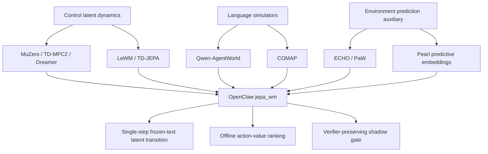
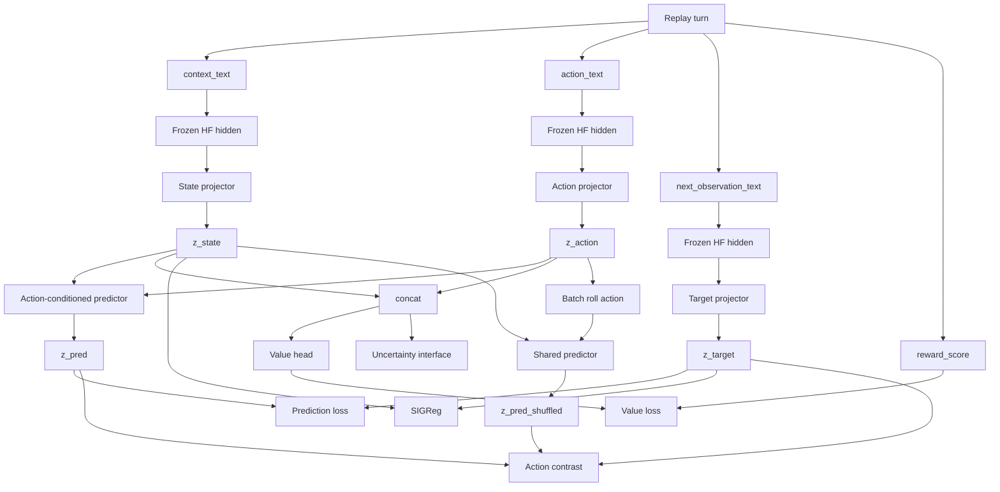
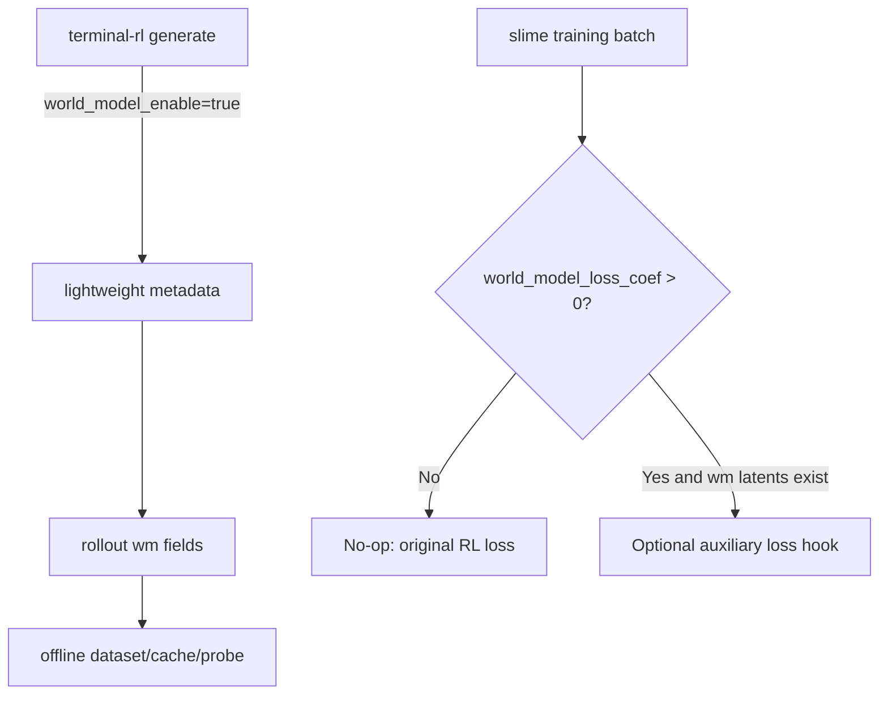
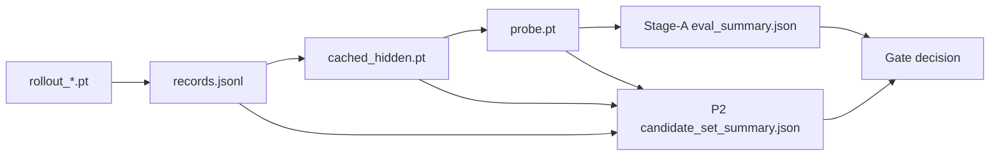

# OpenClaw Latent World Model w/ Value Head

> 项目：OpenClaw-RL `jepa_wm`
> 文档定位：组会讲解、方法说明、实现边界与 PR #19 复现入口
> 更新日期：2026-07-14
> 代码快照：`MING-ZCH:jepa_wm`，以 [PR #19](https://github.com/puyuan1996/OpenClaw-RL/pull/19) 当前 head 为准
> 参考框架：Qwen-AgentWorld 的 Motivation -> Method -> Training/Eval -> Findings 讲解结构

---

## 0. 项目摘要

我们实现了一个默认关闭、可插拔的 **JEPA-style text latent world model**。它不生成完整的下一步 observation 文本，而是将 `context/action/next observation` 的冻结文本编码器 hidden 投影到统一 latent space，学习 action-conditioned transition，并用 `value head` 给 replay 中的候选 action 打分。当前实现只提供离线协议，不直接构成 execution-time 结论。

当前状态：

| 研究问题 | 当前结论 | 验证状态 |
| --- | --- | --- |
| LLM hidden 能否对齐为统一 belief latent？ | 数据、训练和评测接口已实现 | 已实现 |
| predictor 是否使用 action？ | shuffled/zero-action、bootstrap CI 与 group-heldout eval 已实现；PR 未提交 benchmark artifact | 待实验验证 |
| value score 能否排序同 context 候选？ | target-free ranking 与 candidate-set eval 已实现；PR 未提交 benchmark artifact | 待实验验证 |
| latent 能否预测结构化 execution result？ | 当前 PR 未提交结构化 result head/eval | 未验证 |
| latent 能否预测 tool 选择？ | 当前 PR 未提交 tool-choice head/eval | 未验证 |
| uncertainty 能否作为可靠风险估计？ | head 未接受 dedicated loss，当前不可用 | 未验证 |
| 是否提升 online agentic-RL 收益？ | 尚未进行 P2b real-execution shadow gate | 未验证 |

> 当前 PR 交付离线研究框架和评测入口，不提交正向 benchmark 结论。Stage-A 与已执行候选上的离线 P2 已有代码路径；tool/result head、P2b 真实执行采集和 online policy 实验尚未实现。

---

## 1. Motivation

### 1.1 从 Reasoning RL 到 AgenticRL

AgenticRL 不只是把数学 reasoning 的输出换成 shell command。它面对的是一个带外部状态、随机转移和部分可观测性的序贯决策问题：

$$
b_t=P(x_t\mid o_{\leq t},a_{<t}),\qquad
a_t\sim\pi_\theta(\cdot\mid b_t),\qquad
x_{t+1}\sim P(\cdot\mid x_t,a_t)
$$

其中真实环境状态 $x_t$ 通常不可直接访问，policy 只能从 task、历史 action 和 tool feedback 形成内部 belief $b_t$。这与单轮或弱交互的 reasoning RL 有几项根本差异：

| 维度 | Reasoning RL | AgenticRL / Terminal Agent |
| --- | --- | --- |
| 状态转移 | 主要发生在模型内部 token 序列 | 由 Docker、filesystem、process 和外部 tool 决定 |
| 可观测性 | 输入通常固定，接近 fully observed | tool feedback 只是环境状态的局部投影，属于 POMDP |
| 动作空间 | 以同质 token 生成为主 | shell、code edit、API/tool call、plan 等异质动作 |
| 轨迹结构 | 常见单轮长 reasoning | 10 到 100+ turns，历史持续改变下一步可行动作 |
| 中间监督 | 部分任务可逐步校验 | 多数 turn 无可靠 label，terminal verifier 才给强信号 |
| 错误成本 | 主要损失一次采样预算 | 可能污染工作区、消耗 worker，甚至产生不可逆副作用 |

因此，AgenticRL 的关键瓶颈不仅是“policy 不会生成好 action”，还包括：真实 rollout 昂贵、terminal reward 稀疏、失败经验复用弱，以及无法在执行前比较多个 action 的真实后果。

### 1.2 Terminal-RL 的结构性瓶颈

| 结构性特征 | 对训练的直接影响 | world model 的潜在作用 |
| --- | --- | --- |
| 真实交互昂贵且可能不可逆 | 对每个候选 command 做真实执行不可扩展 | 先做低成本 shadow ranking，仅执行 top-k |
| sparse、long-horizon reward | 很难定位导致最终成功/失败的中间 turn | 提供 per-turn outcome/value diagnostic |
| observation 长且噪声大 | stack trace、dump、重复日志主导 token-level loss | 在 latent space 压缩与任务相关的反馈变化 |
| judge/test 信号异质 | unit test 较可靠，LLM judge 可能有噪声或风格偏置 | 只把 learned score 当辅助，保留 verifier 为 ground truth |

需要区分 **anti-collapse** 和 **anti-drift**。SIGReg 等正则可以防止离线 latent 边际分布塌缩，但不能自动解决 online policy 更新后的 hidden distribution 漂移。当前 v1 只覆盖 frozen/cached hidden；EMA、re-anchor 和 online hidden capture 属于后续工作。

### 1.3 Policy-only Agent 的缺口

典型 agent policy 学习的是：

$$
\pi(a_t \mid h_t, s_t)
$$

它回答“下一步做什么”，却不显式回答：

$$
P(o_{t+1}, r_t \mid h_t, s_t, a_t)
$$

对于 Terminal、SWE、Tool-use 等 agentic-RL 场景，这个缺口直接对应三个成本：

1. 每个候选 action 都真实执行会消耗 Docker worker、环境时间和 rollout budget。
2. 错误 action 可能污染文件、进程和环境状态。
3. sparse terminal reward 很难告诉模型“哪个中间动作导致了最终失败”。

因此，我们希望引入一个只做旁路判断的 world model：在执行 action 前估计其后果和价值，在不改动现有 RL 主路径的前提下先做 shadow eval。它服务的优先级和边界如下：

| 用途 | 当前定位 | 原因 |
| --- | --- | --- |
| **U2 pre-execution candidate screening** | 核心目标 | 同 state 比较多个候选 command，是 latent predictor + value 最直接的增量能力 |
| U1 dense shaping / credit diagnostic | 支撑目标 | 缓解 sparse reward，但必须与 ECHO/PRM/value baseline 对比 |
| U3 imagined multi-step replay | 暂不进入 v1 | 长程 latent error 会累积，naive Dyna rollout 可能反而伤害 policy |
| U4 替代真实 verifier | 明确禁止 | terminal correctness 依赖精确文件、进程和字节级状态 |
| learned reward 直接替代 judge 进入 policy gradient | 明确禁止 | 容易形成 Goodhart/reward-hacking 闭环 |

### 1.4 Qwen-AgentWorld 给出的参照

[Qwen-AgentWorld](https://arxiv.org/abs/2606.24597) 将 language world model 定义为下一步环境 observation 生成器：

$$
\hat{o}_{t+1}=f_\theta(c,o_{\leq t},a_{\leq t})
$$

它用可读文本表示环境动力学，适合作为 simulator 或 agent foundation warm-up。我们的目标更窄：优先验证 action screening，而不是完整生成 terminal output。

| 维度 | Qwen-AgentWorld | OpenClaw `jepa_wm` |
| --- | --- | --- |
| 输出空间 | observation token/text | next-observation latent + scalar value |
| 核心任务 | 生成环境反馈 | 预测 latent transition 和 action utility |
| 主要用途 | simulator、Sim RL、LWM warm-up | candidate ranking、latent transition diagnostic |
| 推理成本 | autoregressive generation | frozen encoding + small MLP probe |
| 可解释性 | 输出可读 | latent 不可直接解释，需要 probe/eval |
| 当前成熟度 | 大规模 language world model | 默认关闭的离线 v1 probe |

这两个方向不是互斥关系。Language simulator 更适合生成可读未来、构造 imagined trajectories；latent evaluator 更适合高频、低成本地比较候选 action。当前项目优先回答后一个更窄的问题，而不是声称 latent 可以替代完整 simulator。

### 1.5 核心研究假设

- **H1 Hidden-to-latent**：next-token hidden 可以作为原材料，但必须经过 controlled projector/alignment 才能形成 belief latent。
- **H2 Action sensitivity**：同一 state 下替换 action，应显著改变 predicted latent，并降低与真实 target 的一致性。
- **H3 Outcome utility**：`state/action` latent 应包含 reward 或 execution-result ordering 信号。
- **H4 Safe integration**：world model 默认关闭时，现有 policy/value/reward/environment 行为保持不变。

这四个假设形成逐级 gate，而不是一次性 claim：

```text
H4 integration no-op
  -> H1 representation is trainable and non-collapsed
  -> H2 prediction is action-sensitive
  -> H3 offline outcome/ranking generalizes to heldout context
  -> P2b real-execution screening improves cost-success trade-off
  -> only then consider online auxiliary training
```

---

## 2. 相关工作与定位

### 2.1 阅读边界

相关工作只用于说明方法选择，不属于本 PR 的实验验证。正式投稿前仍需补齐 BibTeX、版本和原文页码。

### 2.2 World Model 的三条技术谱系



#### 谱系 A：Control 中的 Latent Dynamics

[MuZero](https://arxiv.org/abs/1911.08265)、[TD-MPC2](https://arxiv.org/abs/2310.16828)、UniZero、Dreamer 等工作已经说明，`latent dynamics + reward/value head` 是 model-based RL 的成熟范式。因此，本项目的创新点不能仅表述为“在 latent 上增加 value head”。[LeWM](https://arxiv.org/abs/2603.19312) 进一步展示了 reconstruction-free 的 action-conditioned JEPA dynamics，并用 SIGReg 稳定 latent；但其证据来自 pixel/control 域，不直接回答纯 text terminal agent 的 hidden alignment、动作带宽与 verifier 边界。

#### 谱系 B：Language / Agent World Model

[Qwen-AgentWorld](https://arxiv.org/abs/2606.24597) 用文本生成建模 agent-environment transition；[COMAP](https://arxiv.org/abs/2606.02372) 则让 textual world model 与 policy 在 closed loop 中共同演化。它们支持环境反馈预测用于 agent learning/planning，也要求单独评估 multi-step hallucination、生成成本和 sim-to-real gap。本项目先研究 single-step latent prediction，暂不实现 language simulator。

#### 谱系 C：Environment Prediction as Auxiliary Supervision

[ECHO](https://arxiv.org/abs/2605.24517) 和 [PaW](https://arxiv.org/html/2606.02388v1) 表明 next-observation/token prediction 可作为 policy training 的辅助监督；[COMAP](https://arxiv.org/abs/2606.02372) 进一步研究 policy 与 textual world model 的协同和候选 action 后果模拟。它们构成比传统 control WM 更直接的同域 baseline。尤其 ECHO 机制简单、与 terminal feedback 同域，应是必须比较的首要 baseline。

### 2.3 LLM Hidden 能否成为 World Latent

现有工作提供的是“有条件支持”，而不是“raw hidden 天然就是 belief state”：

| 工作/结论 | 对本项目的支撑 | 对本项目的限制 |
| --- | --- | --- |
| [LLM-JEPA](https://arxiv.org/abs/2509.14252) | language hidden/embedding 可以接受 JEPA-style predictive objective | 仍需要专门 projector 和训练目标 |
| [Pearl](https://arxiv.org/html/2604.08065v1) | multimodal tool-use trajectories 可以通过 JEPA-inspired predictive embedding alignment 学习 | 证据来自 VLM/perception tool use，不是纯 text terminal dynamics |
| [VL-JEPA](https://arxiv.org/abs/2512.10942) | continuous semantic target 可替代离散 token reconstruction | 不能自动保证 action sensitivity 或 value calibration |
| [Transformers as implicit state estimators](https://arxiv.org/html/2410.16546v3) | transformer hidden 在任务约束下可承载 POMDP belief 信息 | hidden 不是显式 Markov state，必须由下游目标筛选 |
| [Massive Activations](https://arxiv.org/html/2402.17762v2) | hidden 存在 anisotropy/outlier 风险 | 裸 hidden MSE 可能被少数维度和表面 token 特征主导 |

据此，本项目采用如下定义：

> LLM hidden 是 belief latent 的信息源，不是 belief latent 本身。只有经过 clipping、normalization、source-specific projector、action-conditioned prediction 和 heldout outcome eval 后，才把其任务相关子空间称为 world latent。

因此，当前检验对象是“frozen hidden + controlled projector + predictor”整体，不能把结果归因于 raw HF hidden 已经学会显式 environment dynamics。

### 2.4 最近邻方法与本项目差异

| 方法 | 主要预测对象 | 主要用途 | 与本项目的关键差异 |
| --- | --- | --- | --- |
| Qwen-AgentWorld / COMAP | next observation text 或 future feedback | simulator、policy-WM co-evolution | 我们不生成文本，先做 frozen single-step latent evaluator |
| ECHO / PaW | next-observation token loss | policy auxiliary shaping | 我们提供可独立查询的 predictor/value，用于同 context candidate ranking |
| Pearl | multimodal tool-use trajectory embedding | latent tool reasoning | 我们处理 text terminal replay，并预测 next-feedback latent |
| LeWM | pixel latent next-state | reward-free control/planning | 我们迁移 JEPA/SIGReg 思路，不复用其视觉 encoder 或 MPC setting |
| MuZero / TD-MPC2 | latent dynamics + reward/value | planning 或 credit assignment | dynamics/value 组件本身不是本项目的 novelty |

### 2.5 研究定位与 Claim 边界

目标定位：

> A frozen-text-conditioned latent action-value model for terminal agents, evaluated first on offline candidate ranking while preserving the real verifier as ground truth.

四项约束：

1. **frozen-text-conditioned**：当前 CLI 接受任意冻结 HF encoder；建议与 policy 同系列，但代码不强制同源。
2. **action-value**：必须在同 state 的 counterfactual actions 之间产生可验证差异，不能退化成 `state -> mean feedback`。
3. **calibration measured, not assumed**：prediction loss 低不等于可以控制 policy，必须报告 heldout ranking、risk-coverage 和 real-execution utility。
4. **verifier-preserving**：learned WM 只筛选、排序或辅助信用分配，不替代 unit test / real environment truth。

当前 PR 交付 single-step latent、value ranking 和离线评测协议；尚无 calibration、risk-coverage、P2b real-execution shadow 或 online 证据。因此本阶段只能称为 **offline research infrastructure**。

### 2.6 为什么 v1 不做 Multi-step Imagination

已有 Dyna-style 研究和负结果提醒我们：synthetic rollout 并非免费数据，模型误差会随 horizon 累积，并可能把错误 transition 反复写入 policy。[Stealing That Free Lunch](https://arxiv.org/abs/2412.14312)（ICML 2025）系统报告了 naive Dyna rollout 可能降低性能。基于这一风险，v1 选择：

- 只学习 replay 中可被真实 next observation 监督的 single-step transition。
- 先验证 action sensitivity、heldout ranking 和 calibration。
- 所有 candidate 在 P2b shadow 阶段仍真实执行，用真实 outcome 评估 WM 排序。
- 只有当 single-step gate 稳定通过后，才讨论短 horizon imagination、adaptive horizon 或 confidence-gated replay。

---

## 3. 方法

### 3.1 方案选择

| 设计问题 | 当前选择 | 第一性原理理由 | 暂缓的替代方案 |
| --- | --- | --- | --- |
| 预测空间 | next-observation latent | U2 只需要 outcome-relevant sufficient statistic，不必复原全部日志文本 | autoregressive text/delta simulator |
| 时间跨度 | single-step transition | 每个 target 都有真实反馈锚点，避免 multi-step compounding error | AR-over-turn latent imagination |
| 表征来源 | frozen HF text encoder hidden | 建议选择与 policy 同系列模型，同时隔离 online training 风险；代码不强制同源 | online Megatron middle-layer hook |
| latent 对齐 | state/action/target 独立 projector | 三类文本统计不同，共享裸空间会把 source bias 当 dynamics | raw hidden MSE、单一共享 projector |
| target 形式 | 直接预测 `z_target` | delta 参数化在低变化 terminal turn 容易退化成 trivial copy/zero delta | `z_state + delta` |
| action 表征 | mean pooled single vector | 先以最小实现验证 action signal 和端到端链路 | multi-vector action、token cross-attention |
| 防退化目标 | MSE + SIGReg + action contrast | 分别约束 prediction、latent spread 和 conditional action dependence | 只优化低 MSE |
| decision head | supervised value-only ranking，`beta=0` | 当前 value 有 reward supervision，uncertainty 尚无 dedicated loss | uncertainty penalty、直接 policy control |
| 真值来源 | replay label；execution claim 需真实 verifier | learned model 可能被 exploit，必须保留外部 truth anchor | 用 learned reward 替代 judge/verifier |

这套选择先回答一个可证伪问题：**在同一 context 的已执行 replay candidates 中，predicted latent/value 能否稳定预测 reward 的相对顺序？** 通过离线 gate 后，再由 P2b 全候选真实执行检验 pre-execution screening。

### 3.2 Replay Record Schema

每条样本对应 terminal rollout 的一个 turn：

当前 collector 写入 `openclaw_text_jepa_world_model_v2`；builder 也能读取 v1 历史 records。兼容读取不等于证明旧记录没有未来泄漏，新实验应使用可信 v2 collector。

当前通用 smoke 默认走 `camel-agent`，该路径按 outer model turn 构造 record。A3S/Claude Code 可能在一个 outer turn 中返回多个内部 interactions，并聚合 SDK tool calls；v1 会写入 `world_model_skipped` 原因而不生成 WM record，避免把未对齐数据用于 transition benchmark。

| 字段 | 语义 | 编码后张量 |
| --- | --- | --- |
| `context_text` | task、历史消息和当前 observation | `state_hidden` |
| `action_text` | policy 输出的 text/tool action | `action_hidden` |
| `next_observation_text` | 真实 tool result；最终 turn 无 tool result 时才写 terminal eval summary | `target_hidden` |
| `reward_score` | 当前 turn 的有限 return/step score，仅作为 value label | `reward` + `reward_mask` |
| `status/done/has_tool_result` | execution metadata | eval / diagnostic labels |

与 Qwen-AgentWorld 的 schema 对应关系是：

| 语义角色 | Qwen-AgentWorld | OpenClaw `jepa_wm` |
| --- | --- | --- |
| 环境与任务上下文 | system prompt + history | `context_text` |
| agent action | user/action turn | `action_text` |
| 环境反馈 | assistant observation | `next_observation_text` |
| 学习目标 | observation tokens | projected `target_latent` |

### 3.3 Hidden-to-Belief Latent

LLM hidden 的原始目标是 next-token prediction。它混合了 token identity、position、syntax、style 和语义信息，不天然等于 Markov state 或 belief state。

当前实现使用 frozen HF `AutoModel(...).last_hidden_state`，支持 `mean/last/cls` pooling。建议首个语义 baseline 使用与 policy 同系列模型的 final hidden + mean pooling；PR 不提交模型权重、hidden cache 或 benchmark：

$$
h_t^s=H(s_t), \quad h_t^a=H(a_t), \quad h_{t+1}^o=H(o_{t+1})
$$

$$
z_t^s=P_s(h_t^s), \quad z_t^a=P_a(h_t^a), \quad z_{t+1}^o=P_o(h_{t+1}^o)
$$

`StableProjector` 的实际结构是：

```text
clip -> LayerNorm -> Linear -> GELU -> Linear -> LayerNorm -> L2 normalize
```

### 3.4 Architecture



### 3.5 Action-Conditioned Prediction

`ActionConditionedPredictor` 拼接 state/action latent：

$$
\hat{z}_{t+1}=F_\theta([z_t^s,z_t^a])
$$

其实现是一个带 LayerNorm、GELU 和输出 L2 normalization 的 MLP。模型不只通过 prediction loss 学习，还使用 batch 内 rolled action 构造 counterfactual negative：

$$
\mathcal{L}_{cf}=\max(0,m+d(\hat z_{t+1},z_{t+1}^o)-d(\hat z_{t+1}^{shuffle},z_{t+1}^o))
$$

这使“action 是否真的影响预测”成为显式训练和 eval 问题。

### 3.6 Value Head 与 Uncertainty Interface

Value head 输入 state-action latent：

$$
\hat q_t=V_\psi([z_t^s,z_t^a])
$$

当 `value_coef > 0` 且 `reward_mask` 有效时：

$$
\mathcal{L}_{value}=\operatorname{MSE}(\hat q_t,r_t)
$$

当前限制：

1. 通用脚本默认 `value_coef=0.0`，只有显式设置正系数后 value head 才接受 reward supervision。
2. `uncertainty_head` 当前只有 `softplus(linear(...))` forward interface，`compute_loss()` 没有 dedicated uncertainty loss。因此它不是已校准 epistemic/aleatoric uncertainty。

总 loss 为：

$$
\mathcal L=\mathcal L_{pred}+\lambda_{sig}\mathcal L_{SIGReg}+\lambda_{cf}\mathcal L_{cf}+\lambda_v\mathcal L_{value}
$$

当前没有 $\mathcal L_{uncertainty}$。

### 3.7 Candidate Scoring 与 Leakage Guard

v1 实际使用 value-only score：

$$
score(s_t,a_i)=\hat q(s_t,a_i)
$$

`value - beta * uncertainty` 只是后续设计。当前 uncertainty 没有训练目标，`rank_candidates.py` 的 uncertainty mode 和 P2 的非零 uncertainty coefficient 都会拒绝运行。

`rank_candidates.py` 的 leakage guard：

- 默认 `auto/value` mode 不向模型传入 `target_hidden`。
- 只有显式 `--score-mode pred_error` 才读取 target，用于 oracle diagnostic。
- `candidate_set_eval.py` 会过滤缺失、NaN 或 infinite `reward_score`，并拒绝把重复 action 当成多个候选。
- cache 的 records digest、encoder contract fingerprint、hidden tensor digest，以及逐样本 reward/mask/group metadata digest 必须与 checkpoint/records 一致，用于发现产物错配或未同步修改。
- `auto` eval 只接受精确训练 cache 中持久化的非空 group-heldout split；train/val indices 必须互斥并完整覆盖 cache。
- 排序前拒绝 NaN/Inf score，JSON 输出禁止非标准 `NaN`。

其中 encoder contract fingerprint 绑定 model path、pooling、max length、hidden dim 与固定 canary 的量化输出，可发现同一路径下通常的权重替换，但不等同于大型 HF 权重文件的完整内容 digest。外部 cache 必须使用不可变 model revision 并写入实验 manifest；严格同-cache heldout 会重新计算并核对实际 hidden tensor 与 metadata digest。

排序入口会检查 optimizer/value update、学习率、最终 train loss 和 train reward labels。ranking 保留记录声明的 reward contract；只有可信 adapter 声明 execution outcome 时才标记 execution-eligible，但代码不能独立证明声明来自真实执行。缺少当前 fingerprint 的 legacy cache/checkpoint 必须重建后才能严格 eval/ranking。`pred_error` 必须显式选择，并仅作为使用 target 的 oracle diagnostic。

### 3.8 JEPA-style 的准确边界

当前实现称为 JEPA-style，而不是完整复刻 canonical JEPA：

- predictor 在 latent space 预测 target representation。
- 使用 SIGReg 和 action contrast 抑制退化。
- `target_projector` 默认可学习，`stop_grad_target=False`。
- 已保留 `stop_grad_target` 配置，但尚未实现 EMA target encoder。

因此，EMA/frozen target 是后续 ablation，不应写成当前已经具备的机制。

### 3.9 当前 v1 与完整设计的边界

| 能力 | 当前 v1 | 完整设计/后续方向 |
| --- | --- | --- |
| 数据源 | debug rollout `.pt` snapshots 与静态 offline records | online policy hidden capture + 持久 replay service |
| encoder | frozen HF text encoder cache | policy-coupled Megatron hidden，需处理 PP/CP/SP |
| pooling | `mean/last/cls`，建议首个 baseline 为 mean | learned-query pooling、multi-vector action |
| transition | single-step MLP predictor | turn-level AR predictor、短 horizon imagination |
| target branch | learnable projector，可选 stop-grad | frozen/EMA target encoder + periodic re-anchor |
| anti-collapse | SIGReg + effective-rank diagnostics | 同时监控 anti-drift、CKA/OOD |
| outcome heads | 单一 scalar value head | reward/progress/value 分头与 pairwise/listwise objective |
| uncertainty | forward interface，无专用 loss | ensemble/NLL/quantile + ECE/risk-coverage calibration |
| usage | Stage-A 与已执行记录上的 offline P2 | P2b candidate generation/all-execution shadow，再考虑 online auxiliary |
| policy impact | 默认关闭、无行为改变 | 通过全部 gate 后才允许小权重接入 |

---

## 4. 工程实现与 PR 范围

### 4.1 PR #19 Snapshot

[PR #19](https://github.com/puyuan1996/OpenClaw-RL/pull/19) 的实际分支快照：

| 项目 | 当前值 |
| --- | --- |
| Base branch | `dev-agenticrl-safety-exploration-harness` |
| Head branch | `MING-ZCH:jepa_wm` |
| Core package | `slime/slime/world_model/` |
| Focused tests | 9 test files under `slime/tests/world_model/` |
| Reusable scripts | 5 个通用入口，完整文件名见 [4.4](#44-reusable-scripts) |
| Committed docs | 本讲解稿与 package README |

PR 只保留实现模块、focused tests、通用入口和两份文档，不包含生成的 rollout、cache、checkpoint 或运行日志。

### 4.2 Core Modules

| 文件 | 职责 |
| --- | --- |
| `metadata.py` | 附加因果对齐的 turn metadata，并在落盘前做 credential redaction |
| `build_dataset.py` | 从 rollout `.pt` 抽取、过滤并汇总 records |
| `cache_text_hidden.py` | hash smoke 或 frozen HF hidden cache |
| `modules.py` | projector、predictor、SIGReg、value/uncertainty heads |
| `metrics.py` | 有限数检查与 action sensitivity 等共享指标 |
| `train_probe.py` | group-aware split、可复现 offline training 和 checkpoint metadata |
| `checkpoint.py` | split/provenance 与 value-head update 证据检查，异常时 fail closed |
| `evaluate_probe.py` | action ablation、collapse、value/uncertainty diagnostic |
| `rank_candidates.py` | target-free candidate ranking，并携带 reward-label contract |
| `candidate_set_eval.py` | same-context P2 ranking eval |
| `summarize_stage_a.py` | 默认要求 `group_heldout` 的 Stage-A gate 汇总 |
| `loss_hook.py` | 默认关闭的 online auxiliary hook 边界 |

### 4.3 Integration Boundary



安全边界：

- `world_model_enable=False` 时不记录 world-model metadata。
- `world_model_loss_coef=0.0` 时 auxiliary hook 是 no-op。
- 当前 auxiliary path 只支持 sample-level objective 和 `context_parallel_size=1`。内置 hook 会把 mean loss 按样本数转成 sample-sum；正系数下缺 latent、loss 已 detach、per-token loss 或 CP>1 都会拒绝运行。自定义 graph-connected hook 可能更新 policy，PP/CP/SP 组合尚未验证。
- policy/value loss、reward、environment、Docker worker 和 SETA 数据逻辑不被替换。
- 大 hidden tensor 不进入 `Sample.metadata`，只保存轻量文本和 hash。
- context/action/result 在落盘前清理常见 token、password、Authorization 和 URL credentials。
- HF cache 默认 local-files-only 且 `trust_remote_code=False`；自定义模型代码必须显式 opt-in。
- v1 不在线抓 Megatron middle-layer hidden。
- 外部 LeWM checkout 和训练产物不进入 PR；仓库只保留适配后的通用实现。

Credential redaction 只是 best-effort safety net，不等价于完整 DLP；rollout 与 records 仍按敏感训练数据管理。所有 `.pt` 和 checkpoint 都通过 PyTorch pickle loader 读取，只能使用可信文件。

### 4.4 Reusable Scripts

| 脚本 | 用途 |
| --- | --- |
| `run_world_model_seta_smoke.sh` | 采集 SETA rollout metadata |
| `run_world_model_offline_probe_smoke.sh` | hash encoder pipeline smoke |
| `run_world_model_batch_probe.sh` | 多 rollout records/cache/probe |
| `run_world_model_stage_a_eval.sh` | full/clean/tool-only Stage-A eval |
| `run_world_model_p2_candidate_set_eval.sh` | same-context candidate ranking eval |

离线数据流：



---

## 5. 实验设置

### 5.1 Evaluation Ladder

| 阶段 | 当前状态 |
| --- | --- |
| Pipeline smoke | 已实现并有 focused tests |
| Stage-A action sensitivity | 协议已实现；无 committed benchmark |
| P2 same-context ranking | 已执行记录上的离线协议已实现；无 committed benchmark |
| Context-heldout | 已实现；重复种子需手工重跑，未提供聚合 runner |
| P2b real-execution shadow | 未实现候选生成、全候选执行与结构化标签 adapter |
| Small-coef online auxiliary | 仅有 hook boundary，未开始实验 |

### 5.2 Data Buckets

| Bucket | 选择规则 | 用途 |
| --- | --- | --- |
| `full` | 保留全部可解析 records | 覆盖率基线 |
| `clean` | trajectory completed，且排除配置的 bad eval reasons | 过滤后反馈子集 |
| `tool_only` | `has_tool_result=true`，空字符串 result 也保留 | tool-feedback 子集 |

bucket 数量由输入 rollout 决定，PR 不提交固定 dataset manifest，因此不在此记录本地样本数。

### 5.3 Generic Stage-A Defaults

| 配置 | 值 |
| --- | --- |
| Encoder | `hash` 默认仅用于 smoke；HF 必须显式 opt-in |
| HF hidden | `AutoModel.last_hidden_state`，维度由所选本地模型决定 |
| Pooling | `mean` |
| HF tokenizer max length | 2048 tokens |
| Latent dimension | HF 1024；hash 128 |
| Epochs | HF 5；hash 3 |
| Batch size | 8 |
| Learning rate | `1e-4` |
| `sigreg_coef` | 0.1 |
| `action_contrast_coef` | 0.1 |
| `value_coef` | 0.0；P2 value 实验必须显式设为正数 |
| Validation ratio | 0.25 |
| Train seed | 42 |

### 5.4 Stage-A Metrics

`train_probe.py` 优先按 tokenizer 前的 canonical `context_text` 哈希做 group-disjoint split；HF `max_length` 截断后 token 输入的严格互斥尚未保证。Stage-A 的 `auto` mode 只评估同一 cache 的 validation groups，并检查 train/val indices 互斥且完整覆盖。Stage-A 不是只看 train loss，而是检查：

- real action prediction error。
- shuffled action 与 zero-action gap。
- gap bootstrap 95% CI。
- `action_delta`。
- latent effective rank / variance。
- value-reward Spearman。
- uncertainty 明确标记为 unavailable，避免把未训练 head 的随机输出误当 calibration。

### 5.5 P2 Metrics

同一 `context_hash` 下保留多个 action 不同、已经执行、带有限 reward 且通常有 reward variation 的 candidates。该 evaluator 不负责生成或执行候选：

| 指标 | 定义 |
| --- | --- |
| `WM top1 reward` | score 最高 candidate 的真实 reward |
| `random_expected_reward` | candidate rewards 的均值，即 uniform-random 期望 |
| `WM - random` | WM top1 相对 random expectation 的提升 |
| `hit_oracle` | top1 reward 是否等于候选集最高 reward |
| `oracle_regret` | oracle reward - WM top1 reward |
| `group_spearman` | candidate score 与 reward 的组内排序相关性 |

---

## 6. 当前验证状态

本 PR 不提交 rollout、hidden cache、checkpoint、dataset manifest 或 benchmark summary，因此**没有可随代码审计的实验数值**。当前可以报告的是实现与回归验证，而不是模型效果：

| 能力 | PR 内状态 | 允许的结论 |
| --- | --- | --- |
| Causal turn record 与 credential redaction | 已实现并有单元测试 | 数据接口可用 |
| HF/hash hidden cache 与一致性 provenance | cache schema v4；hidden、reward/mask、group metadata 均参与 fingerprint | 严格消费者可发现产物错配或未同步修改，不能证明数据真实性 |
| JEPA-style probe training | 已实现 | 训练链路可执行，不代表语义预测有效 |
| Group-heldout Stage-A | eval 与 gate 已实现 | 可生成 action/collapse diagnostics，尚无 committed benchmark |
| Target-free candidate ranking | 检查 value 训练证据和记录声明的 reward contract | 可运行已执行候选的离线 ranking，尚无 committed ranking 结果 |
| Uncertainty | 只有 interface，无 dedicated objective | unavailable，禁止用于风险决策 |
| Tool choice / structured execution result | 无 classifier/head/eval | 未实现、未验证 |
| Online RL improvement | 只有默认关闭的 hook boundary | 未验证 |

`pred_error` 依赖真实 target，只能作为 oracle pipeline diagnostic；`auto/value` 才是 target-free score。默认 replay `sample.reward.score` 的语义为 `training_reward_unspecified`。代码只能检查 adapter 是否声明 execution outcome，不能独立核验该声明；正式结论必须同时审计数据采集和真实执行来源。

---

## 7. 当前结论

PR 已实现默认关闭的离线训练与评测链路。现阶段只能确认工程接口和 fail-closed 约束可用；belief latent 的环境充分性、action ranking 泛化和 online 收益仍需可审计 benchmark 验证。

---

## 8. 有效性风险

| 风险 | 当前影响 | 建议控制 |
| --- | --- | --- |
| 无 committed benchmark dataset/artifact | 当前只能审计代码，不能审计模型效果 | 固定 manifest、seed、checkpoint 与 summary 后单独发布实验报告 |
| Reward/task imbalance | accuracy 容易被 majority 主导 | balanced accuracy、macro F1、task-stratified split |
| Same-context replay bias | 可能记忆 context/reward prior | context/task heldout 与 real-execution shadow |
| 重复 action 被误作多个候选 | 会扭曲 random baseline 与排序指标 | 评测候选子集若含重复 action，严格 evaluator 直接丢弃该 group |
| HF token 截断后输入可能相同 | `context_hash` 按 tokenizer 前文本分组，不能保证 token-level 互斥 | 记录 token-id digest，并按实际 encoder input 分组 |
| Group 数量与 reward variation 未知 | ranking 方差与统计功效未知 | 预注册最小 group 数、bootstrap CI 与 task-stratified split |
| Reward shortcut | latent 可能不理解完整 transition | status/error/tool-result 多任务 heads |
| 缺少 command-level 标签 | 无法严谨评估 tool 与 execution status | 原生结构化 tool metadata |
| 非 Camel harness 的内部 turn 聚合 | A3S/Claude Code 可能把多次内部 interaction 合成一个 outer record | 当前 fail closed；后续增加 harness-specific causal alignment adapter |
| Offline frozen HF hidden | 与 online policy hidden 有 domain gap | 后续小流量 hidden capture 对照 |
| Learnable target projector | 可能协同收缩 | stop-grad/EMA/frozen-target ablation |
| Value ranking precondition | 未训练 head 会产生无意义 score | 已 fail closed；持续验证 checkpoint metadata 兼容性 |
| Reward contract 由记录自声明 | 代码无法证明 label 确由真实执行产生 | 可信 adapter、采集日志和 verifier artifact 联合审计 |
| Uncertainty 无监督 | 风险分数无可解释校准 | NLL/quantile/ensemble + ECE/risk-coverage |
| `.pt` / checkpoint 使用 pickle loader | 不可信文件可执行任意代码 | 只加载可信产物，后续评估 safetensors/JSON sidecar |

---

## 9. 后续计划

### P0：把离线正信号升级为 Real-Execution Evidence

| 任务 | 交付物 | 通过标准 |
| --- | --- | --- |
| P2b shadow candidate screening | 同 state 生成 K 个 candidates，全部真实执行 | `WM-random` bootstrap CI > 0 |
| 严格 heldout 重跑 | 使用 group split、seed、provenance 和可信 v2 collector | `evaluation_split.scope=group_heldout` 且可重复 |
| Structured result labels | `tool_name/status/error_type/exit_code/progress_bin` | 不再依赖 regex label |
| Ranking precondition | 检查 `value_coef`、reward mask、score source | 未训练 head fail closed |

### P1：改进 Value 与 Uncertainty

| 任务 | 目的 | 核心指标 |
| --- | --- | --- |
| Context-normalized value | 提升跨 context calibration | Spearman、NDCG、ECE |
| Pairwise/listwise value loss | 直接优化 candidate ordering | hit_oracle、regret |
| Dedicated uncertainty loss | 让 uncertainty 对 error/risk 有意义 | error correlation、risk-coverage |
| Ensemble/MC dropout baseline | 给 learned uncertainty 提供参照 | selective execution utility |

### P2：增强 Latent Dynamics

- 同 context hard negatives：相似命令、不同结果。
- 多任务 heads：reward bin、execution status、error type、tool-result validity。
- `mean/last` pooling 和 hidden layer ablation。
- learnable target vs stop-grad vs EMA target ablation。
- 对 boilerplate/no-change/retry transitions 降权。

### P3：Online Auxiliary Hook

只有以下 gate 全部通过后再打开小系数 online loss：

1. P2b `WM-random` 稳定为正。
2. ranking precondition 和 no-target leakage test 通过。
3. uncertainty calibration 或明确禁用 uncertainty。
4. 对原 RL reward、KL、entropy、throughput 做 no-regression 对照。

---

## 10. 组会讨论问题

1. 我们更希望 world model 学“完整 environment transition”，还是只学“action utility sufficient statistic”？
2. Value head 应回归原始 reward，还是直接学习 pairwise/listwise candidate preference？
3. Tool selection 应定义为 behavior cloning label，还是以 real execution outcome 定义最优 tool？
4. Pred latent effective rank 较低是有用压缩还是 reward shortcut？
5. Target branch 是否应升级为 EMA encoder，还是保持共同可学习 projector？
6. P2b 中应该以 task success、step reward、error avoidance 还是综合 utility 作为主指标？
7. 最小 heldout group 数和统计功效应如何预注册，达到什么门槛后才进入 online shadow？

---

## 11. 复现与验证

### 11.1 Generic Entry Points

```bash
cd /path/to/OpenClaw-RL

# 1. Metadata collection
bash terminal-rl/scripts/run_world_model_seta_smoke.sh

# 2. Build records explicitly, then run hash smoke
SMOKE_ROOT="$(find runs/world_model_smoke -mindepth 1 -maxdepth 1 -type d | sort | tail -1)"
ROLLOUT="$(find "$SMOKE_ROOT/metadata" -name 'rollout_*.pt' | sort | head -1)"
PYTHONPATH=slime python -m slime.world_model.build_dataset \
  --input "$ROLLOUT" \
  --output "$SMOKE_ROOT/metadata/records.jsonl"
WM_RECORDS="$SMOKE_ROOT/metadata/records.jsonl" \
  bash terminal-rl/scripts/run_world_model_offline_probe_smoke.sh

# 3. Real frozen HF hidden
WM_ENCODER=hf \
WM_ALLOW_HF=1 \
WM_HF_MODEL=/path/to/Qwen3-8B \
WM_INPUT_GLOB='runs/world_model_smoke/*/metadata/rollout_*.pt' \
bash terminal-rl/scripts/run_world_model_batch_probe.sh

# 4. Stage-A transition diagnostics; value head remains disabled
STAGE_ROOT="$PWD/runs/world_model_stage_a_eval/repro"
WM_OUT_DIR="$STAGE_ROOT" \
  bash terminal-rl/scripts/run_world_model_stage_a_eval.sh
PYTHONPATH=slime python -m slime.world_model.summarize_stage_a \
  --input "$STAGE_ROOT" \
  --output "$STAGE_ROOT/gate_summary.json"

# 5. P2-ready Stage-A and heldout candidate-set eval.
# Requires at least two already-executed, finite-reward candidates in a heldout context.
P2_ROOT="$PWD/runs/world_model_stage_a_eval/p2_value"
WM_OUT_DIR="$P2_ROOT" \
WM_ENCODER=hf \
WM_ALLOW_HF=1 \
WM_HF_MODEL=/path/to/Qwen3-8B \
WM_VALUE_COEF=0.05 \
WM_VAL_RATIO=0.25 \
bash terminal-rl/scripts/run_world_model_stage_a_eval.sh

WM_P2_BASE_EXP="$P2_ROOT" \
WM_P2_ALLOW_UNVERIFIED_REWARD_LABELS=1 \
bash terminal-rl/scripts/run_world_model_p2_candidate_set_eval.sh
```

上面的 override 只用于验证 CLI 与 metric schema；默认 collector 的 reward contract 未证明 execution outcome，输出会标记 `diagnostic_only=true`。脚本不会生成或执行候选，没有合格 group 时会按设计退出。正式 execution eval 需要可信 adapter 声明 `reward_label_is_execution_outcome=true`，并同时归档真实执行和 verifier 证据；布尔字段本身不是真实性证明。

### 11.2 PR Validation

同步前验证命令：

```bash
PYTHONPATH=slime python -m pytest slime/tests/world_model -q
python -m py_compile slime/slime/world_model/*.py slime/tests/world_model/*.py
for script in \
  terminal-rl/scripts/run_world_model_seta_smoke.sh \
  terminal-rl/scripts/run_world_model_offline_probe_smoke.sh \
  terminal-rl/scripts/run_world_model_batch_probe.sh \
  terminal-rl/scripts/run_world_model_stage_a_eval.sh \
  terminal-rl/scripts/run_world_model_p2_candidate_set_eval.sh; do
  bash -n "$script"
done
git diff --check origin/dev-agenticrl-safety-exploration-harness...HEAD
git diff --check
```

2026-07-14 本地验证环境为 Python 3.10.19、PyTorch 2.9.1、pytest 6.2.5：world-model test suite `90 passed`。覆盖 causal context identity、legacy prompt 与 Authorization credential redaction、head-tail result 截断、HF left/right padding、encoder/cache mismatch、reward/group cache 修改、heldout split 重叠或缺失、重复 action、未声明 execution label、in-sample gate、缺失截断统计、空 candidate group、detached auxiliary 和 NaN/Inf 拒绝。Python compile、5 个 shell 入口语法与两种 `git diff --check` 均通过。当前开发容器未安装 Ray；测试只为导入 `slime.utils.misc` 注入空 `ray` module，world-model 用例不调用 Ray API。PR 当前没有 CI check，合并前仍需在目标依赖环境复跑。

PR 不提交生成产物或数值 benchmark。正式实验应通过上述通用脚本生成，并把 model revision、dataset manifest、seed、配置、checkpoint digest 与 machine-readable summary 作为同一实验包归档。

---

## 12. 代码索引

### 12.1 仓库内依据

| 内容 | 仓库路径 |
| --- | --- |
| 方法讲解、实现边界与复现入口 | `rl_doc/openclaw_latent_world_model_value_head_talk_20260714.md` |
| 模型实现 | `slime/slime/world_model/modules.py` |
| 数据构造 | `slime/slime/world_model/build_dataset.py` |
| Hidden cache | `slime/slime/world_model/cache_text_hidden.py` |
| Stage-A eval | `slime/slime/world_model/evaluate_probe.py` |
| P2 eval | `slime/slime/world_model/candidate_set_eval.py` |
| Candidate ranking | `slime/slime/world_model/rank_candidates.py` |
| Checkpoint score guard | `slime/slime/world_model/checkpoint.py` |
| Package README | `slime/slime/world_model/README.md` |

## 13. 实现边界与常见问题（截至 2026-07-14）

以下回答以 PR #19 当前代码为准；未通过实验 gate 的内容明确标为后续工作。

### 13.1 `observation` 与 `action` 如何定义

当前 world-model 的最小学习单元是一个 model turn，而不是单个 token 或单条 shell command：

$$
\tau_t=(c_t,a_t,o_{t+1},r_t,d_t,m_t)
$$

| 变量 | 当前字段 | 代码定义 | 关键边界 |
| --- | --- | --- | --- |
| pre-action belief/context $c_t$ | `context_text` | task metadata + 执行 action 前的 `context_messages` | 只能包含 action 前可见信息，不能包含未来 feedback |
| action $a_t$ | `action_text` | `assistant_output` 与本 turn 所有 `tool_name(json_args)` 拼接 | 一个 model turn 内的多个 tool call 当前被合成一个复合 action |
| next observation $o_{t+1}$ | `next_observation_text` | 所有真实 tool result 拼接；中间 turn 无结果时写 `no_tool_result`；只有最终 turn 可写 eval summary | 不把未来 terminal outcome 回灌给中间 transition |
| supervision $r_t$ | `reward_score` | 保存有限的 `Sample.reward["score"]`，可包含上游折扣 return/PRM | 只作为 value label，不进入 state/action/target encoder |
| terminal/meta | `done/status/trajectory_status/has_tool_result` | `status` 保持 turn-causal；`trajectory_status` 仅供离线过滤 | `done=True` 只出现在最后 turn |

三个文本字段默认各自最多保存 `4096` characters，并使用 `head_tail` 截断；写入前会清理常见 credential pattern。这里的 observation 是 agent 可见反馈，不是 Docker 的完整真实状态；因此模型学习的是 POMDP 下的 belief transition，而不是完整环境 state transition。

当前把一个 turn 内的多个 command/result 聚合成 **turn-level composite transition**。command-level tool 或 exit-status 预测需要保留 `tool_call_id/tool_name/args/result/exit_code`。Web、API、SWE 等环境必须新增 schema adapter，保证 pre-action 无未来泄漏、action 可规范化、feedback 因果对齐且 terminal/truncation 明确；非文本 observation 还需要额外 encoder。

### 13.2 `observation/action latent` 如何得到

完整定义见 [3.3 Hidden-to-Belief Latent](#33-hidden-to-belief-latent) 和 [3.4 Architecture](#34-architecture)。三类文本先经同一个 frozen HF `AutoModel.last_hidden_state` 与 `mean/last/cls` pooling 得到 raw hidden，再分别进入 `state/action/target_projector`。projector 执行 clipping、LayerNorm、MLP 与 L2 normalization；统一空间来自联合训练约束，不是 raw LLM hidden 的天然属性。`hash` encoder 只验证 wiring，不提供语义证据。

### 13.3 `observation/action latent` 如何融合：当前不是 AdaLN

当前 predictor 使用 $\hat z_{t+1}=F_\theta([z_t^s;z_t^a])$，即 pooled state/action vector concat 后进入 one-step MLP；value head 同样读取 `[z_state; z_action]`。LeWM 的 token/sequence-level AdaLN、Transformer/AR predictor 和 self-attention conditioning 均未实现。concat + MLP 是最小可证伪基线，是否应升级 AdaLN 必须由等预算 ablation 决定。

### 13.4 当前整体架构是否等于完整 online 设计

不等于。当前 PR 是 frozen-cache、single-step、offline-first 子集；完整边界见 [3.9](#39-当前-v1-与完整设计的边界)。online policy hidden capture、next-prompt branch、独立 feedback encoder、共享 adapter、AdaLN/AR predictor、feedback head 和联合 DAPO/GRPO training 均未实现。value 有 supervised offline path，uncertainty 只有未训练 interface。

### 13.5 默认与离线 probe 路径是否影响 policy 主干

**默认不会。** 离线 probe 与 policy computation graph 隔离：

1. frozen HF encoder 在 `torch.no_grad()` 下生成 `cached_hidden.pt`。
2. `train_probe.py` 只优化 projector、predictor、value/uncertainty head 等 probe 参数。
3. `--world-model-enable` 默认关闭；关闭时不增加 metadata 与 loss wiring。
4. `--world-model-loss-coef` 默认 `0.0`；通用 metadata smoke 入口也显式使用 `0`。
5. 内置 online hook 只有收到 graph-connected `wm_pred_latents/wm_target_latents` 才计算 MSE；当前没有从 Megatron live hidden 构造这些 tensor。

PR 已提供 custom hook 入口。若自定义 hook 从 `logits` 或 live hidden 构造 graph-connected loss，并设置 `world_model_loss_coef>0`，就可能更新 policy backbone。该路径尚未做 online A/B，需要单独验证 reward、KL、entropy 和 throughput。

### 13.6 Reward / Value head 如何学习，loss 是什么

Value head 读取当前 state-action latent，而不是 predicted next latent：

$$
\hat q_t=W_v[z_t^s;z_t^a]+b_v
$$

当 `reward_score` 有限、`reward_mask=True` 且 `value_coef>0` 时：

$$
\mathcal L_{value}=\operatorname{MSE}(\hat q_t,r_t)
$$

总 loss 还包含 prediction、SIGReg 和 action contrast，公式见 [3.6](#36-value-head-与-uncertainty-interface)。`reward_mask` 防止把缺失 reward 当作 `0.0`；通用脚本默认 `value_coef=0.0`。默认 label 语义为 `training_reward_unspecified`，不能自动解释为 tool execution success。

这个 head 直接回归 replay 中预先计算的 outcome/step score，并依赖 action，更接近 supervised $Q(c_t,a_t)$ / action utility probe，而不是经典的 state-only $V(c_t)$。head 自身没有 bootstrap、TD($\lambda$) 或 GAE。P2 会保留 reward contract；即使 adapter 声明 execution outcome，正式结论仍需审计真实执行来源。

`uncertainty_head` 当前没有 dedicated loss；即使 forward 能输出正数，也不能当作已校准 uncertainty。

### 13.7 训练轨迹如何得到

完整链路见 [4.4 Reusable Scripts](#44-reusable-scripts)：terminal rollout 生成 `turn_records`，真实 Docker/tool execution 与 verifier 完成后附加轻量 WM metadata，再由 debug rollout `.pt` 构造 `records.jsonl`、hidden cache 和 probe。中间 turn 只使用真实 tool result 或 `no_tool_result`，最终 turn 才允许 terminal summary；`reward_score` 只作为 masked value label。当前严格对齐范围是默认 `camel-agent` outer turn；A3S/Claude Code 的多-interaction outer turn 会 fail closed，其他格式也需要显式 schema adapter。

### 13.8 LWM 训练的收益：哪些已验证，哪些只是目标

| 预期收益 | 当前实现 | 当前证据 | 结论 |
| --- | --- | --- | --- |
| 离线 latent auxiliary objective | 已实现 standalone probe loss | PR 内只有实现与回归测试 | 待 benchmark |
| execution-result prediction | 无 classifier/head/eval | 无结构化 heldout 指标 | 未实现 |
| 已执行候选的离线 ranking | 已实现 value interface 与 P2 eval | 无 committed benchmark | 待严格 heldout benchmark |
| pre-execution candidate screening | 无候选生成/全执行 shadow harness | 无 P2b 结果 | 未实现 |
| 直接辅助 DAPO/GRPO backbone | 仅有 hook 边界 | 未进行 live-hidden online A/B | 未验证 |
| value 给 GRPO 提供 advantage | 未接入 | 无 online reward/variance 结果 | 未实现 |
| 提升 sample efficiency / final reward | 未接入 | 无等预算 online baseline | 未验证 |
| 替代 verifier | 明确不做 | terminal correctness 需要真实执行 | 禁止 claim |

因此，“直接作为辅助损失”当前只在独立 probe 内成立；“作为 policy auxiliary loss 有收益”必须与 DAPO/GRPO 和 ECHO token-CE 做等 rollout、等 forward、等 auxiliary weight 的 online 对照。

value 用于 advantage 还存在一个理论边界：当前 head 是 action-dependent $\hat q(c,a)$。policy-gradient 中可无偏直接相减的 baseline 通常必须不依赖 sampled action；直接把 $\hat q(c,a)$ 当 $V(c)$ 使用会改变优化目标。后续可选路线是训练独立 state-only $V(c)$、构造经验证的 control variate，或把 action-value 仅用于 candidate selection。任何 `value-to-advantage` 接入都应从 `eta=0` 开始，并报告 bias、variance、KL、entropy 和 final reward。

### 13.9 如何借鉴 ECHO、Qwen-AgentWorld 与 LeWM

ECHO 提供同域 token-level auxiliary baseline；Qwen-AgentWorld 提供 `context/action/next observation` schema 和 text simulator 参照；LeWM 提供 reconstruction-free、action-conditioned JEPA 与 SIGReg 思路。当前代码按 text terminal 约束重写，没有复制 LeWM 的 pixel encoder、AdaLN/AR predictor 或 MPC stack，也没有实现 ECHO 的 policy auxiliary 和 Qwen-AgentWorld 的文本生成器。

### 13.10 核心区别与潜在优势

核心区别是：以冻结 HF hidden 为原材料，经受控 projector 学 action-conditioned next-feedback latent，并提供 state-action score。建议 encoder 与 policy 同系列，但当前实现不强制。潜在优势是无需为每个候选 autoregressively 生成完整 terminal output；PR 尚无 latency、GPU cost、P2b success-rate 或 online sample-efficiency benchmark，不能写成已经优于 ECHO 或 Qwen-AgentWorld。

### 13.11 Replay buffer 如何实现、大小是多少

PR #19 没有实现 production replay service，也没有固定 `buffer_size`。当前数据源只有 `--save-debug-rollout-data` 生成的 `.pt` snapshots，以及由其派生的静态 `records.jsonl/cached_hidden.pt`；容量、淘汰、在线 append、PER 和统一 sampler 均不在本 PR。

若后续实现 persistent replay，至少需要 `schema_version/capacity/eviction/dedup/task cap/reward-status stratification/snapshot lineage`。建议持久化轻量文本与 provenance，并按 encoder revision 离线重算 hidden，避免不同 policy/encoder 版本混入同一几何空间。

### 13.12 Tool-use 与 execution-result prediction 能否在开发机完成

可以完成 head、dataset adapter 和离线 eval，但当前 PR 尚未实现它们。Tool-use 任务需要 command-level `tool_name` label，报告 top-1 accuracy、macro F1 和 task-heldout accuracy；execution-result 任务需要 `status/error_type/exit_code/progress_bin`，报告分类指标与 calibration。现有 turn-level composite records 不足以给出严谨结论，必须先重建结构化 records。

### 13.13 后续顺序

完整计划见 [第 9 节](#9-后续计划)。顺序应为：结构化 command/result adapter，固定 task-heldout Stage-A，P2b 同状态候选全执行，对比 random、LM logprob、ECHO、value-only 与 latent+value；通过后再考虑 online auxiliary、MPC 或 latent MCTS。

---

## 14. 阶段结论

`jepa_wm` 当前交付以下离线链路：

```text
rollout data
  -> frozen HF hidden
  -> controlled belief latent
  -> action-conditioned next-latent prediction
  -> value-based candidate ranking
  -> heldout ranking / action diagnostics
```

当前实现支持 Stage-A 与已执行候选上的离线 P2。P2b 仍缺候选生成、全候选真实执行和结构化标签适配；完成这些工作后，才能评估 pre-execution screening 和 online policy control。
