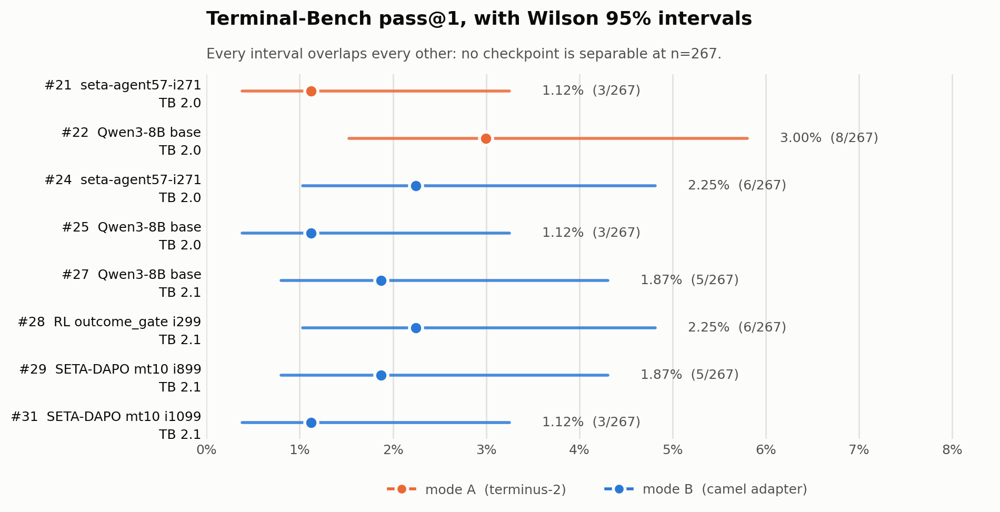

# Harbor × camel-agent 训练侧对齐评测（mode B）

## TL;DR

Harbor 自带的 `terminus-2` agent 与 terminal-rl 训练侧的 `CamelAgent` 在一批配置维度上不一致，直接用它评测训练出的 checkpoint，分数里混着"模型能力"和"评测 harness 与训练不一致"两种成因，无法区分。`terminal-rl/eval/mode_b_aligned/adapter/openclaw_camel_adapter.py` 是一个 Harbor `BaseAgent` 适配器，让 Harbor 继续负责 docker-compose 生命周期、任务装配和 verifier，只把 agent 驱动换成训练时那条代码路径。两条路线记为 mode A（`terminus-2`）与 mode B（本适配器）。已跑过的 8 次全量评测结果见「历史评测」一节：所有 pass@1 都落在 1.12%–3.00% 区间，Wilson 95% 区间两两重叠，没有任何一对 checkpoint 在 n=267 下可分。方向上有一个已记录的变化：[issue #25](https://github.com/HansBug/OpenClaw-RL/issues/25) 把 [#22](https://github.com/HansBug/OpenClaw-RL/issues/22) 提出的"RL 净负迁移"判定为 **DIRECTIONALLY REFUTED, sign-flipped** —— 错位 harness 下观测到的 `i271 < base` 在对齐 harness 下不再成立，ΔRL 由负转正 `+1.12 pp`，但单 cell 的 Fisher `p = 0.504`、interaction `p = 0.084`，都未达显著。使用方法见 [`../eval/mode_b_aligned/README.md`](../eval/mode_b_aligned/README.md)，在受限 GPU worker 上的完整运维流程见 [`TBV21_HARBOR_FULL_EVAL_zh.md`](TBV21_HARBOR_FULL_EVAL_zh.md)。

## 1. 适配器的对齐面

[issue #23](https://github.com/HansBug/OpenClaw-RL/issues/23) 的审计列了 14 个错位 knob，但那 14 个不全都落在适配器里：其中 `attention_backend`、`sampling_backend`、`chunked_prefill_size`、`max_prefill_tokens`、`mem_fraction_static`、`--context-length`、sglang `random_seed`、`--trust-remote-code` 属于 SGLang 服务端，由 [`../eval/mode_b_aligned/launchers/launch_sglang.sh`](../eval/mode_b_aligned/launchers/launch_sglang.sh) 钉死；`harness 对 context-exceed 的处理` 是换用 camel-agent 之后自然消失的差异。下表是**适配器自身**负责的对齐面，与 #23 的清单有交集但不是同一张表。

| # | Knob | Mode A（terminus-2） | Mode B（本适配器） | 实现位置 |
|---|---|---|---|---|
| 1 | Harness class | Harbor `terminus-2` | Harbor `BaseAgent` + `CamelAgent` + `SGLangTurnClient` | `OpenClawCamelAgent.run()` |
| 2 | Prompt / chat template | terminus-2 自定义 role 顺序 | HF tokenizer 自带 chat template | `_build_sglang_client()` |
| 3 | Tool schema | 单 tool `execute` | 训练侧 4-tool（`shell_exec` / `shell_view` / `shell_write_to_process` / `shell_write_content_to_file`） | `_extract_4_tool_schemas()` |
| 4 | Tool 返回值渲染 | JSON stringify | `TerminalToolkit` 函数原生返回值，非 `str` 时才 `json.dumps` | `_exec_tool()`（`adapter/openclaw_camel_adapter.py:463-484`） |
| 5 | `max_iteration` | terminus-2 自有 `max_episodes`，本仓库未记录其取值 | 10 | `__init__(max_iteration=10)` |
| 6 | `max_parse_errors` | 未 pin | 3 | `__init__(max_parse_errors=3)` |
| 7 | `temperature` | terminus-2 默认 0.7 | 1.0 | `_build_sampling_params()` |
| 8 | `top_p` / `top_k` | 未生效：`Terminus2.__init__()` 不转发这两个 kwarg，它们到不了 `litellm.completion()`（#23 §"代码层面 blocker"） | 1.0 / -1 | `_build_sampling_params()` |
| 9 | `max_new_tokens` | 同上，不转发 | 8192（`rollout_max_response_len`） | `_build_sampling_params()` |
| 10 | `max_total_tokens` | 未 pin | 16384 | `_build_sglang_client()` |
| 11 | `skip_special_tokens` | True | False，保留 `<think>` / `<tool_call>` | `rollout_skip_special_tokens=False` |
| 12 | `tool_call_parser` | Harbor 内建 | `qwen25` | `SGLangTurnClient(tool_call_parser='qwen25')` |
| 13 | `non_think_mode` | 不注入 | 由 kwarg 控制，默认 False | `non_think_mode` kwarg |

有一个参数容易被误读成对齐 knob：`rollout_seed`（默认 42）**没有下发给 SGLang**。`_build_sampling_params()`（`adapter/openclaw_camel_adapter.py:314-328`）只发 `temperature`、`top_p`、`max_new_tokens`、`skip_special_tokens`，以及 `top_k > 0` 时的 `top_k`，不含 `seed`；`inference_client.py` 里也没有任何 `seed`。它只被写进轨迹 metadata（`:719`）。因此 mode B 的采样实际不是逐 trial 可复现的，真正生效的只有 SGLang 服务端的 `--random-seed`。这一点在八次历史评测中同样成立，改它会让结果不再与那八次同口径，所以这里只做记录，不做修改。

## 2. 适配器结构

适配器共 800 行，对外只暴露一个类 `OpenClawCamelAgent`（`adapter/openclaw_camel_adapter.py:190`）。它继承 Harbor 的 `BaseAgent`，通过 `--agent-import-path openclaw_camel_adapter:OpenClawCamelAgent` 被加载，对 Harbor 上游无侵入。`name()` 返回 `"openclaw-camel-agent"`，`version()` 返回 `"0.1.0"`，两者都会被 Harbor 写进 job manifest。

`setup(environment)` 在每个 trial 开始前被调用一次，做四件事：建 `logs_dir`；首次调用时惰性加载 tokenizer 和 SGLang client；用 `docker ps --filter label=com.docker.compose.project=<sanitized>` 找到 Harbor 起的 compose main container；基于该 container 构造 `TerminalToolkit` 并抽出 4 个 tool schema。这里有一条必须保持的不变量：每个 trial 都要一个全新的 `TerminalToolkit`，因为 Harbor 会在 trial 结束后销毁容器。容器名走 `docker ps` 而不是 Harbor 内部 API，是为了不依赖 Harbor 的私有实现。

`run(...)` 是主 rollout 循环：把任务 instruction 作为 system message 构造 `CamelAgent`，然后反复调用 `SGLangTurnClient` 生成、解析 tool call、执行工具、把结果追加回对话历史，直到触发终止条件。终止条件决定写入 trajectory 的 `status` 字段，判定顺序在 `adapter/openclaw_camel_adapter.py:691-700`：`max_tokens_exceeded` 或达到 `max_iteration` 记 `TRUNCATED`，累计解析错误达到 `max_parse_errors` 记 `FAILED`，`final_response` 为 `None` 记 `ABORTED`，其余记 `COMPLETED`。注意 `TRUNCATED` 不等于失败，SETA 与 Terminal-Bench 的 verifier 都可能给 `TRUNCATED` 的 trial 打出满分。

## 3. 两处兼容性处理

`SGLangTurnClient` 通过 `slime.utils.http_utils.post` 发请求，而该函数依赖一个模块级 `httpx.AsyncClient` 单例，训练时由 `Trainer.init_http_client(args)` 初始化。评测时没有 Trainer，适配器分两种情况处理：装了 `slime` 就走 `_ensure_real_slime_http_client_initialized()`（`adapter/openclaw_camel_adapter.py:131`）补上单例；没装 `slime` 就走 `_install_slime_shim_if_missing()`（`adapter/openclaw_camel_adapter.py:65`）注入一个同接口的 httpx 实现。两条路径互斥，取决于运行环境里有没有 `slime`。

transformers 5.x 起，`apply_chat_template(tokenize=True)` 返回 `BatchEncoding` 而不是 `List[int]`，而训练时（transformers 4.51）的 `SGLangTurnClient` 假定拿到的是 `List[int]`。`_load_tokenizer()`（`adapter/openclaw_camel_adapter.py:287-311`）在 tokenizer 上包一层：仅当 `tokenize=True` 且未指定 `return_tensors` 时，把 `BatchEncoding` 拆回 `input_ids`。这是对 transformers 具体版本行为的适配，transformers 再改这个返回类型时需要同步修改。

## 4. 历史评测

以下 8 次全量评测的数字均取自对应 issue 正文，可逐条回溯。Terminal-Bench 2.0 与 2.1 是两个不同的任务集，跨版本的数字不能直接相减。所有 `k=3` 的行都是 89 任务 × 3 次 = 267 个 trial；pass@3 一列是 empirical pass@3，即"至少通过一次的任务数 / 89"，不是无偏 pass@k 估计。

| Issue | 数据集 | 被测 checkpoint | Harness | pass@1 | pass@3 | 解出的任务 |
|---|---|---|---:|---:|---:|---|
| [#21](https://github.com/HansBug/OpenClaw-RL/issues/21) | TB 2.0 | seta-agent57-i271 | mode A | 1.12%（3/267） | 3.37%（3/89） | 含 `configure-git-webserver` |
| [#22](https://github.com/HansBug/OpenClaw-RL/issues/22) | TB 2.0 | Qwen3-8B base | mode A | 3.00%（8/267） | 5.62%（5/89） | `constraints-scheduling`、`hf-model-inference`、`cancel-async-tasks`、`fix-git`、`prove-plus-comm` |
| [#24](https://github.com/HansBug/OpenClaw-RL/issues/24) | TB 2.0 | seta-agent57-i271 | **mode B** | 2.25%（6/267） | 3.37%（3/89） | 与 #21 重叠 1 个（`configure-git-webserver`） |
| [#25](https://github.com/HansBug/OpenClaw-RL/issues/25) | TB 2.0 | Qwen3-8B base | **mode B** | 1.12%（3/267） | 2.25%（2/89） | `hf-model-inference`、`modernize-scientific-stack` |
| [#27](https://github.com/HansBug/OpenClaw-RL/issues/27) | TB 2.1 | Qwen3-8B base | **mode B** | 1.87%（5/267） | 3.37%（3/89） | `filter-js-from-html`、`modernize-scientific-stack`、`query-optimize` |
| [#28](https://github.com/HansBug/OpenClaw-RL/issues/28) | TB 2.1 | RL outcome_gate iter299 | **mode B** | 2.25%（6/267） | 4.49%（4/89） | `modernize-scientific-stack`、`prove-plus-comm`、`qemu-startup`、`sqlite-with-gcov` |
| [#29](https://github.com/HansBug/OpenClaw-RL/issues/29) | TB 2.1 | SETA-DAPO baseline mt10 iter899 | **mode B** | 1.87%（5/267） | 5.62%（5/89） | `configure-git-webserver`、`filter-js-from-html`、`hf-model-inference`、`modernize-scientific-stack`、`pypi-server` |
| [#31](https://github.com/HansBug/OpenClaw-RL/issues/31) | TB 2.1 | SETA-DAPO baseline mt10 iter1099 | **mode B** | 1.12%（3/267） | 3.37%（3/89） | `configure-git-webserver`、`modernize-scientific-stack`、`qemu-startup` |

<picture>
  <source media="(prefers-color-scheme: dark)" srcset="assets/harbor_camel_mode_b/modeb_pass_at_1_dark.png">
  
</picture>

把八行的点估计和 Wilson 95% 区间画在一起，是为了让"两两重叠"这件事一眼可见：表格里 1.12% 和 3.00% 看起来差了快三倍，但在 n=267、成功数只有个位数的量级上，它们的区间几乎完全套在一起。图由 `scripts/plot_modeb_eval_history.py` 生成，其 Wilson 实现在 `tests/test_openclaw_camel_adapter.py` 里对 #27、#28、#29 已公布的区间做了回归。

另有一次 TB 2.1 × `qwen3-8b-rl-iter215` 的 `terminus-2`（mode A）单次全量跑，89 个 trial 聚合分数 2.0 / 89 = 2.25%，解出 `configure-git-webserver` 与 `hf-model-inference`；它是 [`TBV21_HARBOR_FULL_EVAL_zh.md`](TBV21_HARBOR_FULL_EVAL_zh.md) 里那套运维流程的验证运行，k=1 而非 k=3，被测 checkpoint 也不是上表里的任何一个，不与上表同口径，不要与 #27 的 mode B 数字混用。

## 5. 从这些数字能得出和不能得出的结论

能得出的：mode A 下 terminus-2 会让 i271 产生大量"占位帧"空转，#24 测到该现象在 mode B 下降到 0%，这一项完全可归因于 harness；对齐 harness 让 i271 的 pass@1 从 1.12% 变成 2.25%，但 Fisher exact 双侧检验 p = 0.50，在 n=267 下两组统计学上无法区分。

不能得出的：不能说 mode B "修好了"评测。base 在 TB 2.0 上 mode A（3.00%）反而高于 mode B（1.12%），说明对齐 harness 不是单向提分；也不能跨 TB 2.0 与 TB 2.1 比较，#27 明确记录了它与 #25 不是 bit-identical A/B，除数据集版本外还有 TP=8 与 TP=4、SGLang 版本等残余差异。所有 pass@1 的 Wilson 95% 置信区间互相重叠，把其中任何两行的点估计之差解释为能力差异都缺乏统计支持。

## 6. 已知边界

适配器只覆盖上表这 13 个 knob，issue #23 清单里的 SGLang 服务端项由 `launch_sglang.sh` 钉住；Docker 镜像版本、Terminal-Bench harness 自身的补丁、checkpoint 是否与历史评测字节一致这几项在历史评测中未逐项核对。mode B 的采样也没有逐 trial 固定种子，见 §1 末尾关于 `rollout_seed` 的说明。评测跑出 task 级超时属于评测结果而非基础设施故障，不应该临场改任务；只有 SGLang 退出、Docker daemon 不通、Harbor 主进程退出但 job 未写 `finished_at` 这几类才是需要介入的基础设施问题，判据见 [`TBV21_HARBOR_FULL_EVAL_zh.md`](TBV21_HARBOR_FULL_EVAL_zh.md)。
