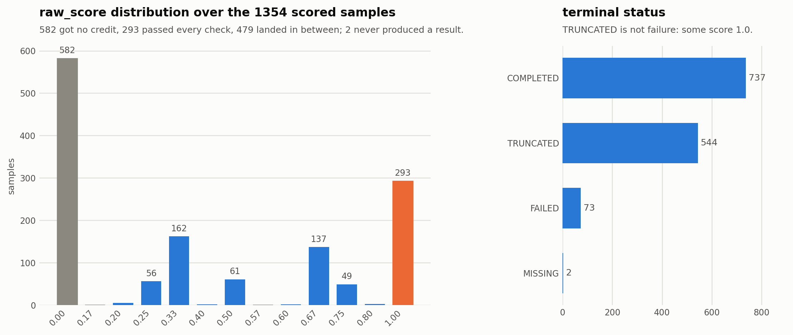

# SETA-env 原始验证器准确率评测

## TL;DR

这套流程用 SETA-env **自带的验证器**测一个 checkpoint 在 1356 条 SETA 任务上的准确率，不经过 Terminal-Bench，也不使用训练时的塑形奖励。主指标是 `raw_score`，含义是"这个任务自己的验证检查通过了多少比例"，取值 0 到 1；`exact_pass` 定义为 `raw_score == 1.0`。Qwen3-8B 原始基线的已发布结果是 `raw_score` 均值 38.77%、精确全通过率 21.61%（[issue #33](https://github.com/HansBug/OpenClaw-RL/issues/33)）。**38.77% 不是"38.77% 的任务成功了"**，而是"平均每个任务拿到 38.77% 的验证器分数"；两个数字差这么多，说明基线能在不少任务上完成一部分验证要求，但把全部检查打通的比例明显更低。跑法是 `scripts/run_seta_env_eval.sh` 做一次全量，`scripts/analyze_seta_env_eval.py` 合并出报告并导出补跑清单，再对补跑清单降并发重跑，最后把三次一起分析。`terminal-rl/tests/test_analyze_seta_env_eval.py` 用 issue #33 的公开审计包做回归，保证这套脚本能复现出 38.77% / 21.61%。

## 1. 指标口径

**先明确它测的是什么分布。** 默认数据集 `terminal-rl/dataset/seta_env_convert/train.filtered.jsonl` 就是 SETA 训练所用的那一份（[issue #21](https://github.com/HansBug/OpenClaw-RL/issues/21) 的配置表把同一路径列为训练数据）。所以这套流程量的是「在训练分布上学到了多少」，不是泛化能力；要看泛化，用 Terminal-Bench 那条 held-out 线。两者互补，任何一方的数字都不能替另一方说话。


`raw_score` 是 SETA 验证器返回的检查通过比例。`0.333333` 这类分数表示只通过了部分检查，具体检查项由每个任务自己的验证器定义。报告里不把训练过程中的 `task_reward` 或 `total_reward` 当作准确率，它们经过奖励塑形，与验证器分数不是一回事；分析脚本会把它们一并导出，仅供对照。

每个比率都给两个分母。`*_completed_rows` 只统计产出了结果的样本；`*_all_dataset_missing_as_zero` 用整个数据集做分母，并把因基础设施问题没跑出结果的样本按 0 计。**报告口径用后者**，因为前者会把"跑不起来"的样本悄悄从分母里去掉，从而高估准确率。

`status` 与准确率是两件事。`TRUNCATED` 表示达到轮次或步数预算，`FAILED` 表示推演或评测过程报错，`MISSING` 表示所有重试后仍没有结果行。`TRUNCATED` 的样本完全可能拿到满分：issue #33 的第 4 号样本状态是 `TRUNCATED` 而 `raw_score = 1.0`，计入精确全通过。所以不能用 `COMPLETED` 的比例代替准确率。

## 2. 为什么必须有补跑

全量一次跑不完是常态，原因是远端 Docker 重置会对部分任务失败。已发布的那次运行分三轮：main 用并发 16 跑完 1356 条，得到 1251 条结果、105 条缺失；supp1 对这 105 条重跑，追回 98 条；supp2 把最后 7 条并发降到 2，追回 5 条。剩下 2 条在三轮里都失败，`/reset` 持续返回 HTTP 500，最终按 0 计入。

降并发是有效的：最后 7 条里有 5 条是在并发从 16 降到 2 之后才跑出来的。剩下 2 条对应的任务有特殊的宿主要求，`seta_env/718` 的 compose 要 `NET_ADMIN` 和 `/dev/net/tun`，`seta_env/1045` 要绑定宿主 443 和 80 端口，这是排查方向而不是已证实的根因，`/reset` 返回 500 本身并不能证明是这两项导致的。

## 3. 跑一次完整评测

第一步，全量。`HF_CKPT` 指向要评测的 checkpoint，`WORKER_URLS` 和 `ENV_SERVER_URL` 指向同一内网的 Docker worker 与环境路由服务。

```bash
HF_CKPT=/path/to/checkpoint \
WORKER_URLS=http://<docker-worker>:18081 \
ENV_SERVER_URL=http://<env-router>:18080 \
CONCURRENCY=16 \
bash terminal-rl/scripts/run_seta_env_eval.sh
```

驱动脚本把 `SLIME_ENTRYPOINT` 指向 `slime/eval_only.py`，这是它成为只读评测而不是训练的原因；把 `MAX_CKPT_KEEP` 设为 0，因为没有东西需要保存，而默认检查点目录对评测用户未必可写；把 `EVAL_N_SAMPLES` 设为 1，因为它委托到的启动脚本默认是 16，而已发布基线跑的是每条 eval prompt 一次推演——证据是那次运行的 `analysis/all_index_rows.csv` 里每个 `(run_label, sample_index)` 恰好一条轨迹。最后这条不能省：分析脚本对每条样本只保留一条轨迹，继承 16 会让成本涨 16 倍，而且报出来的不再是单次尝试的分数，而是十六次里被最后读到的那一次。脚本同时把训练侧的 `N_SAMPLES` 钉为 1，它不被 `eval_only.py` 读取，钉住只是让 `run_config.json` 继续记录已发布的 `n_samples: 1`。想先看解析出来的配置而不真的启动，加 `DRY_RUN=1`。

第二步，分析并导出补跑清单。

```bash
python terminal-rl/scripts/analyze_seta_env_eval.py \
  --dataset terminal-rl/dataset/seta_env_convert/train.filtered.jsonl \
  --run main=runs/<main-run-dir> \
  --out runs/<main-run-dir>/analysis_main \
  --supplement-out runs/<main-run-dir>/supp1.jsonl
```

第三步，对补跑清单降并发重跑。补跑 JSONL 是过滤后的子集，所以它每一行的 metadata 里带了 `supplement_sample_index`，记录该行在原始数据集里的行号；这个字段会随推演进入轨迹的 `sample_metadata`，分析脚本靠它把补跑轨迹映射回原始样本。

```bash
HF_CKPT=/path/to/checkpoint \
WORKER_URLS=http://<docker-worker>:18081 \
ENV_SERVER_URL=http://<env-router>:18080 \
PROMPT_DATA=runs/<main-run-dir>/supp1.jsonl \
CONCURRENCY=2 \
bash terminal-rl/scripts/run_seta_env_eval.sh
```

第四步，合并全部轮次。`--run` 可以重复，**按时间顺序传**，后面的轮次覆盖前面的。

```bash
python terminal-rl/scripts/analyze_seta_env_eval.py \
  --dataset terminal-rl/dataset/seta_env_convert/train.filtered.jsonl \
  --run main=runs/<main-run-dir> \
  --run supp1=runs/<supp1-run-dir> \
  --run supp2=runs/<supp2-run-dir> \
  --out runs/<main-run-dir>/final_analysis
```

## 4. 跨 checkpoint 比较

benchmark 表按 checkpoint 一行一行填时，最容易犯的错是把 21.61% 和 23.60% 读成"提升了两个点"。`exact_pass` 是 1356 条上的二项计数，两个 checkpoint 到底能不能分开是有答案的。`scripts/compare_seta_env_evals.py` 吃多个 `summary.json`，给每个运行配一个 Wilson 95% 区间（描述该运行自身比率的位置），再用**两比例 z 检验**回答"两者是否不同"这个独立的问题。

之所以不靠看区间是否重叠来判断：**不重叠确实蕴含显著，但重叠并不蕴含不显著**。这是个常见陷阱，而且在本数据集的量级上真会踩到。

还有一层更重要：两个 checkpoint 跑的是**同一批 1356 条样本**，这是配对数据，而两比例 z 检验假设两个样本相互独立。同物品重复测量带来的正相关会让独立检验偏保守——它不会造假阳性，但会把真实效应报成"无证据"。所以只要把 `per_sample.csv` 而不是 `summary.json` 传给脚本，它就按 `sample_index` 做连接，改用**精确 McNemar 检验**（只看两边结论不一致的那些样本）。差别可以很大：下面演示数据里同样是 +1.99 pp，独立检验给 `p = 0.215` 判为"无证据"，而若两边的不一致样本是 8 对 35，McNemar 给出 `p < 0.001`。

```bash
python terminal-rl/scripts/compare_seta_env_evals.py \
  qwen3-8b-base=runs/<run-a>/final_analysis/summary.json \
  rl-iter499=runs/<run-b>/final_analysis/summary.json \
  rl-iter399=runs/<run-c>/final_analysis/summary.json
```

输出形如：

```text
run                n  miss  raw_score  exact_pass     rate         Wilson 95%
qwen3-8b-base   1356     2     38.77%         293   21.61%   19.50% -  23.88%
rl-iter499      1356     0     42.48%         320   23.60%   21.42% -  25.93%
rl-iter399      1356     0     46.73%         352   25.96%   23.70% -  28.36%

exact_pass, per pair:
  qwen3-8b-base vs rl-iter499   delta +1.99 pp   two-proportion z (unpaired)   z +1.240   p 0.2151   no evidence of a difference
  qwen3-8b-base vs rl-iter399   delta +4.35 pp   two-proportion z (unpaired)   z +2.661   p 0.0078   differ (p < 0.05)   [Wilson intervals overlap; the test, not the intervals, decides]
  rl-iter499 vs rl-iter399   delta +2.36 pp   two-proportion z (unpaired)   z +1.423   p 0.1547   no evidence of a difference
The unpaired test assumes independent samples. Two runs over the same dataset are paired; pass per_sample.csv instead of summary.json for an exact McNemar test, which has more power here.
Comparing the Wilson intervals by eye does not answer this: overlap does not imply absence of a difference.
Note: raw_score is average partial credit, not a solve rate; exact_pass is the solve rate.
```

上面第二、三行是构造出来演示读法的，不是实测结果；只有 `qwen3-8b-base` 那一行是 issue #33 的真实数据。第二条配对正是那个陷阱：`293` 与 `352` 的 Wilson 区间明明重叠，检验却给出 `p = 0.0078`。如果按"区间重叠所以不可分"来读，就会把一个真实效应当噪声丢掉——这恰好是这个工具要防的错误，所以判定一律以检验为准，区间只作描述，两者结论不一致时输出会明确标出来。

限制要记住：`summary.json` 只够做独立两比例检验，而同数据集的比较本质是配对的，所以那条路径偏保守，能拿到 `per_sample.csv` 就用配对模式；z 检验是正态近似，本数据集期望计数远大于 5，但贴近 0.05 的结果值得再做精确检验；k 个运行产生 k(k-1)/2 次比较，宽表里接近 0.05 的 p 值要按多重比较来看。

用配对模式只要把路径换掉：

```bash
python terminal-rl/scripts/compare_seta_env_evals.py \
  qwen3-8b-base=runs/<run-a>/final_analysis/per_sample.csv \
  rl-iter499=runs/<run-b>/final_analysis/per_sample.csv
```

## 5. 产物

| 文件 | 内容 |
|---|---|
| `summary.json` | 全部聚合指标，两种分母各一份 |
| `per_sample.csv` | 每条数据集样本一行，含状态、`raw_score`、轮数、工具调用数、token 数、轨迹路径 |
| `task_summary.csv` | 按任务聚合 |
| `status_counts.csv` | 状态分布及占数据集比例 |
| `failure_events.csv` | 从训练日志解析出的 `Generate failed` 事件，按轮次内的单次推演去重，不是一次重试一行 |

## 6. 基线数字

以下来自 [issue #33](https://github.com/HansBug/OpenClaw-RL/issues/33)，被测对象是未经任何 RL 训练的 Qwen3-8B 原始基线。

| 指标 | 数值 |
|---|---:|
| 总样本 / 有结果 / 缺失 | 1356 / 1354 / 2 |
| `raw_score` 均值（缺失按 0） | 38.77% |
| `raw_score` 均值（仅有结果样本） | 38.83% |
| 精确全通过 | 293 / 1356 = 21.61% |
| 非零得分 | 772 / 1356 = 56.93% |
| 状态分布 | COMPLETED 737、TRUNCATED 544、FAILED 73、MISSING 2 |
| 失败事件 | 114，全部为 `HTTPStatusError` |

<picture>
  <source media="(prefers-color-scheme: dark)" srcset="assets/seta_env_eval/seta_env_baseline_20260709_dark.png">
  
</picture>

左图是为什么必须区分两个指标：`raw_score` 呈明显的双峰，582 条一分未得、293 条满分，中间 479 条拿到部分分数。只看均值 38.77% 会把这三群混成一个数。右图是为什么不能用状态代替准确率：TRUNCATED 有 544 条，但其中不乏 `raw_score = 1.0` 的样本。两张图都由 `scripts/plot_seta_env_eval.py` 从 `summary.json` 生成，换一次运行重跑即可。

## 7. 这套脚本与已发布结果的关系

`analyze_seta_env_eval.py` 是按 issue #33 审计包的输出格式重写的，不是当时那份脚本的副本。它与已发布结果的一致性有四条可复核的证据。审计包 `seta_qwen3_8b_base_core_audit_20260709_101409.tar.gz` 的 SHA256 为 `889f634decddfb681c1cc8b2c52b1c5dbad005313abb218812120893093ce110`，与 issue 正文记录一致。聚合层在 `tests/test_analyze_seta_env_eval.py` 里针对该审计包的 1356 行 `per_sample.csv` 运行，复现出全部计数与比率，浮点求和顺序造成的末位差异在 1e-12 相对容差内。逐轨迹派生量（轮数、工具调用数、解析错误轮数、输入输出 token）在审计包附带的 60 条真实轨迹上逐字段零误差。失败事件解析在三个轮次的日志上解析出 114 个唯一 uid，与已发布的 `failure_events.csv` 的 uid 集合完全相同。

四条里只有第二条在仓库内可重跑：`tests/test_analyze_seta_env_eval.py` 用提交进 `tests/data/` 的精简夹具覆盖它。第一、三、四条需要完整的 3.6 MB 审计包，重跑脚本与全部原始输出放在审计 gist：https://gist.github.com/HansBug/aaaa08f8ced69faad5b6d2dd591af6b7 。

需要说明清楚的边界：`per_sample.csv` 的列顺序和 `summary.json` 的键顺序按本脚本的定义生成，与当时那份产物不保证逐字节相同；对齐的是数值与语义，不是文件格式。本脚本的 `summary.json` 比当时那份多一个 `scored_count` 字段，它是所有 `*_completed_rows` 比率的真实分母；正常运行中它等于 `result_count`，只有当某条样本有轨迹却没有 `raw_score` 时才会小于后者，这时两个数必须能被分辨开。

## 8. 复现已发布基线所需的外部条件

内网端点需要同一内网的环境路由与 Docker worker 服务才能复现。已发布运行使用 4 张 H200、TP=4，评测温度 1，最大响应长度 8192，最大上下文 16384，每条 prompt 一次推演（`n_samples: 1`），观测到的最大轮数为 10。这些参数由 `configs/rollout_qwen3_think.yaml`、启动脚本和 `EVAL_N_SAMPLES` 决定，改动它们会让结果不再与上表同口径。
