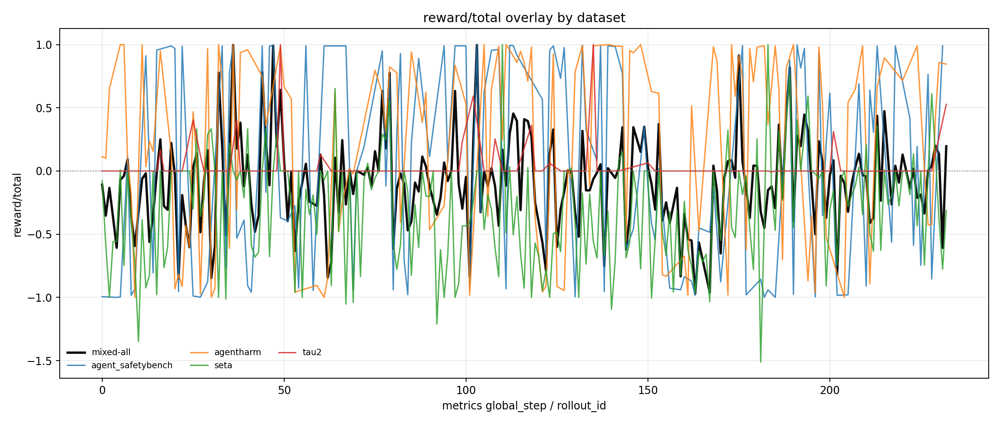
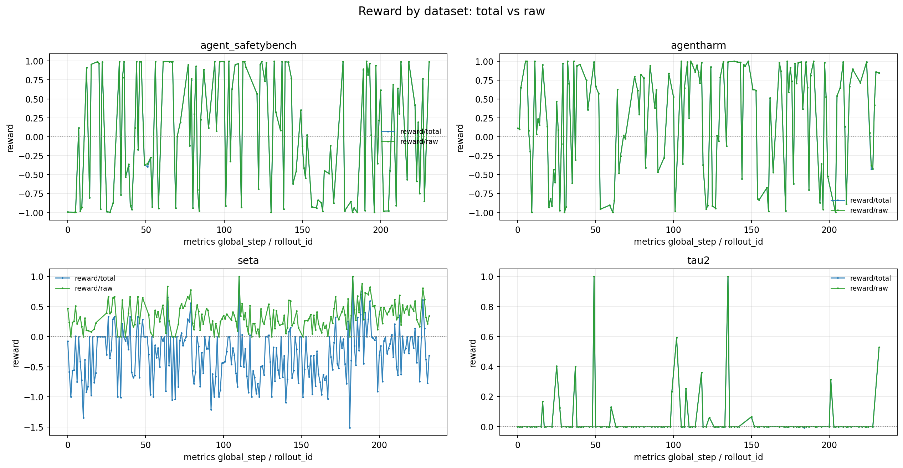
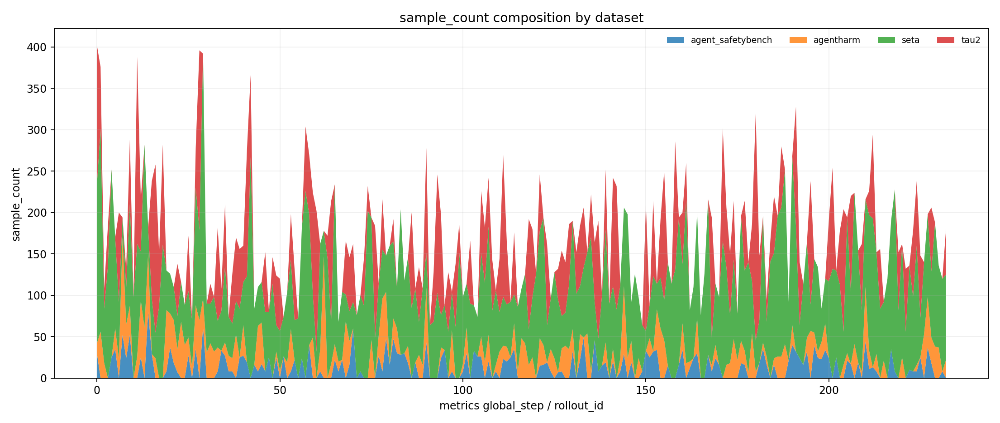
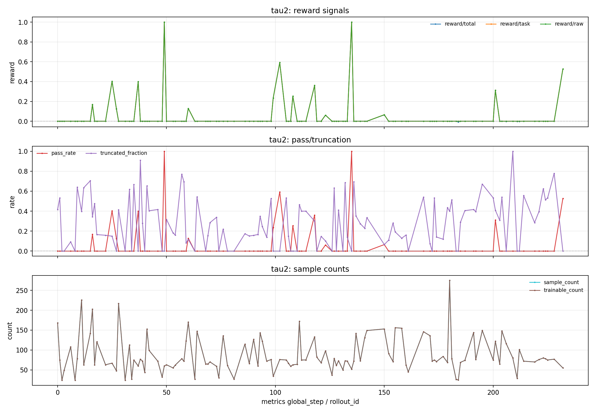
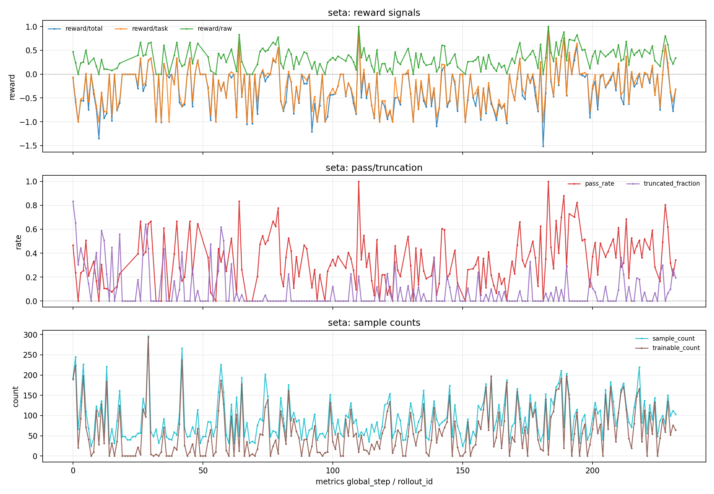

# Mixed Tau2 DAPO Baseline 训练报告

本文档记录 `terminal-rl` 中 Qwen3-8B mixed dataset + tau2 的 DAPO baseline 训练配置、数据构造方式、启动方法和当前 reward 结果。报告重点不是说明单个模块的实现细节，而是回答：本次 mixed baseline 如何构造、如何复现、当前训练结果是什么。

## 1. 实验目标

本次实验的目标是把 tau2-bench 纳入现有 Terminal-RL mixed training 流程，并形成一个可以复用的 DAPO baseline：

- 支持 `DATASET=tau2` 单独训练 tau2 任务。
- 支持 `DATASET=mixed` 同时混合 `seta / tau2 / agentharm / agent_safetybench`。
- 在 rollout 中保留 per-dataset structured metrics，避免只看 mixed aggregate。
- 产出可用于后续对比的 baseline reward 曲线和 trajectory 统计。

当前使用的主要启动脚本为：

```text
terminal-rl/terminal-rl_qwen3-8b_mixed_tau2_dapo_baseline_nodynamic_pu.sh
```

当前最终分析 run 为：

```text
runs/terminal-rl_qwen3-8b_2gpu_mixed_tau2_dapo_nodynamic_think_s7_tau21_ah1_asb1_harness-camel-agent_mt10_2026-07-08_201741
```

## 2. 训练数据集选择

本 baseline 支持以下 `DATASET` 选项：

| `DATASET` | 含义 | 环境 / reward 来源 |
|---|---|---|
| `seta` | Terminal-Bench / SETA capability tasks | Docker terminal env + task tests / shaped reward |
| `safety` | Agent-SafetyBench tasks | ASB mock env + safety reward |
| `agentharm` | AgentHarm safety tasks | AgentHarm adapter + direct score |
| `tau2` | tau2-bench tasks，支持 solo / non-solo 两种交互模式 | tau2 env + tau2 evaluator / user simulator |
| `mixed` | 多数据源混合训练 | 按比例拼接上述数据源 |

当前 mixed baseline 的默认比例是：

```text
seta : tau2 : agentharm : agent_safetybench = 7 : 1 : 1 : 1
```

对应脚本变量为：

```bash
MIX_SETA_RATIO=7
MIX_TAU2_RATIO=1
MIX_AGENTHARM_RATIO=1
MIX_SAFETY_RATIO=1
```

## 3. 数据构造方式

### 3.1 tau2 数据转换

tau2 任务通过下面的转换脚本写成 Terminal-RL 可消费的 JSONL：

```text
terminal-rl/data_utils/convert_tau2_to_dataset.py
```

转换脚本会从 tau2-bench 中读取指定 domain / split / policy type，并写入 metadata，例如：

```text
data_source=tau2
tau2_domain
tau2_task_id
tau2_task_split
tau2_policy_type
tau2_ticket
tau2_solo_mode
```

默认 tau2 telecom train solo 数据输出目录为：

```text
terminal-rl/dataset/tau2_telecom_train_solo
```

### 3.2 tau2 两种交互模式

tau2 在当前接入中支持两种模式：

| 模式 | 交互方式 | 是否使用用户模拟器 | 适用场景 |
|---|---|---|---|
| `solo` | ticket / instruction 一次性给到 agent，agent 只能通过工具和最终回复完成任务 | 否 | 更接近单轮 benchmark / 训练数据构造，链路简单、速度更稳定 |
| `non_solo` | agent 的普通文本回复会传回 tau2 `UserSimulator`，由模拟用户继续生成下一轮 user message | 是 | 更接近真实客服 / 助手交互，可测试澄清、追问和多轮用户反馈 |

本次 mixed DAPO baseline 使用的数据目录名仍是 `tau2_telecom_train_solo`，含义是这些样本是按 solo-compatible 的方式转换成 Terminal-RL JSONL；训练 run 中实际交互模式由 `TAU2_MODE` 或样本 metadata 中的 `tau2_mode` 决定。

当前 PR 已经接入 non-solo 所需的用户模拟链路：

```text
assistant text reply -> /agent_reply -> Tau2Env.handle_agent_reply -> UserSimulator -> env_user_message
```

也就是说，`TAU2_MODE=non_solo` 时会用到 tau2 的用户模拟器；`TAU2_MODE=solo` 时不会调用用户模拟器。本报告对应的 mixed baseline 主要关注训练数据和 reward 结果，数据构造仍以 solo-compatible JSONL 为基础。

### 3.3 AgentHarm 数据转换

AgentHarm 数据由脚本在需要时自动检查 / 转换，转换后的目录为：

```text
terminal-rl/dataset/agentharm_convert
```

其中包含 train / validation / test_public 的 harmful、benign 和 chat 格式数据。

### 3.4 mixed 数据拼接

当 `DATASET=mixed` 时，脚本会按配置比例组合以下数据源：

```text
terminal-rl/dataset/seta_env_convert/train.jsonl
terminal-rl/dataset/tau2_telecom_train_solo/train.jsonl
terminal-rl/dataset/agentharm_convert/train.jsonl
terminal-rl/dataset/agent_safetybench_convert/train.jsonl
```

生成 mixed JSONL：

```text
terminal-rl/dataset/mixed_seta_tau2_agentharm_safety.jsonl
```

当前本地生成文件规模为：

```text
mixed_seta_tau2_agentharm_safety.jsonl          20000 lines
mixed_seta_tau2_agentharm_safety.filtered.jsonl 19771 lines
```

其中 filtered 文件用于过滤部分不适合训练或不可用的样本；最终训练入口以脚本实际导出的 `ROLLOUT_PROMPT_DATA` 为准。

## 4. 训练启动方式

### 4.1 基本启动命令

在 repo 根目录执行：

```bash
cd /mnt/shared-storage-user/puyuan/lixueyan/agentic-rl

DATASET=mixed \
bash terminal-rl/terminal-rl_qwen3-8b_mixed_tau2_dapo_baseline_nodynamic_pu.sh
```

如果需要显式指定 Docker env worker：

```bash
cd /mnt/shared-storage-user/puyuan/lixueyan/agentic-rl

export WORKER_URLS="http://100.96.26.133:18081"

DATASET=mixed \
bash terminal-rl/terminal-rl_qwen3-8b_mixed_tau2_dapo_baseline_nodynamic_pu.sh
```

如果当前 shell 的 `LD_LIBRARY_PATH` 会污染系统 `curl` / CUDA runtime，可以使用：

```bash
env -u LD_LIBRARY_PATH \
DATASET=mixed \
bash terminal-rl/terminal-rl_qwen3-8b_mixed_tau2_dapo_baseline_nodynamic_pu.sh
```

### 4.2 两卡默认配置

本次 baseline 使用 2 GPU 配置：

```text
NUM_GPUS=2
ACTOR_GPUS=1
ROLLOUT_GPUS=1
ROLLOUT_NUM_GPUS_PER_ENGINE=1
TP_SIZE=1
```

训练参数中显式传入：

```text
--num-gpus-per-node ${NUM_GPUS}
--actor-num-gpus-per-node ${ACTOR_GPUS}
--rollout-num-gpus ${ROLLOUT_GPUS}
```

这样可以避免内部默认卡数与实际两卡环境不一致，导致 Ray / SGLang / Megatron 调度卡住。

### 4.3 关键 DAPO 配置

当前 baseline 使用 DAPO，并关闭 dynamic sampling：

```text
ALGO=dapo
DAPO_DYNAMIC_SAMPLING=0
```

常用训练配置包括：

```text
MAX_TURN=10
DAPO_EPS_CLIP_LOW=0.2
DAPO_EPS_CLIP_HIGH=0.28
DAPO_CALCULATE_PER_TOKEN_LOSS=1
```

脚本会把关键配置写入 run 目录下的：

```text
config/run_config.json
logs/metrics.jsonl
logs/train.log
trajectories/
```

## 5. Step 口径说明

本次报告中的 reward 曲线横轴使用 `metrics.jsonl` 里的 `global_step`。

在当前 run 中：

```text
global_step == rollout_id
849 / 849 条 metrics record 完全一致
```

因此本文中的 `global_step` 可以理解为 structured rollout metrics 的 step。

需要注意的是，训练日志里的 train step label 是另一套日志编号。当前从 `train.log` 解析到：

```text
514 个 train-like labels
306 个 unique labels
```

它适合用于 loss / optimizer / grad / KL 诊断，不建议和 per-dataset reward 的 `global_step` 混用。

## 6. 最终结果

### 6.1 metrics 总览

当前最终分析使用的 metrics 文件为：

```text
runs/terminal-rl_qwen3-8b_2gpu_mixed_tau2_dapo_nodynamic_think_s7_tau21_ah1_asb1_harness-camel-agent_mt10_2026-07-08_201741/logs/metrics.jsonl
```

统计结果：

```text
metrics records: 849
global_step: 0 -> 232
unique global_step: 233
schema: terminal_rl.per_dataset_metrics.v1
```

包含 dataset：

```text
mixed-all
seta
tau2
agentharm
agent_safetybench
```

### 6.2 Reward 曲线

总 reward 叠加图：



分 dataset reward 总览：



sample count 组成：



### 6.3 分 dataset 指标

| Dataset | points | step range | last `reward/total` | mean `reward/total` | last raw / pass_rate | mean truncation |
|---|---:|---:|---:|---:|---:|---:|
| `mixed-all` | 222 | 0 -> 232 | 0.1957 | -0.0848 | 0.4936 | 13.35% |
| `agent_safetybench` | 133 | 0 -> 231 | 0.9900 | 0.0357 | 0.9900 | 0.49% |
| `agentharm` | 140 | 0 -> 232 | 0.8455 | 0.2312 | 0.8455 | 4.31% |
| `seta` | 233 | 0 -> 232 | -0.3125 | -0.3041 | 0.3438 | 8.42% |
| `tau2` | 121 | 0 -> 232 | 0.5273 | 0.0464 | 0.5273 | 27.65% |

完整 CSV 已复制到：

```text
terminal-rl/docs/assets/mixed_tau2_dapo_baseline_20260710/dataset_reward_summary.csv
```

### 6.4 tau2 细节曲线



当前 tau2 的特点是：

- 末尾 `reward/total = 0.5273`。
- 平均 `reward/total = 0.0464`。
- median 为 0，说明大部分 step 仍然没有稳定正反馈。
- mean truncation 较高，为 27.65%。
- trajectory 正 reward 比例仍然较低，属于典型 sparse reward 场景。

### 6.5 SETA 细节曲线



当前 SETA 的特点是：

- raw / pass_rate 平均为正：0.3396。
- total reward 平均为负：-0.3041。
- 这说明 `reward/total` 受到 shaped reward、truncation penalty 或其他 penalty 项显著影响。
- 因此 SETA 不能只看 raw/pass_rate，需要同时看 total reward。

## 7. Trajectory 统计

当前 trajectory summary：

| Dataset | trajectories | status summary | reward mean | positive reward ratio | zero reward ratio | eval errors |
|---|---:|---|---:|---:|---:|---:|
| `agent_safetybench` | 312 | completed 312 | -0.1482 | 41.35% | 0.00% | 0 |
| `agentharm` | 336 | completed 332, truncated 4 | 0.3691 | 70.24% | 0.60% | 0 |
| `seta` | 610 | completed 546, truncated 47, failed 17 | -0.4196 | 27.70% | 5.25% | 3 |
| `tau2` | 1416 | completed 1077, truncated 339 | 0.0487 | 4.87% | 95.13% | 0 |

完整 CSV 已复制到：

```text
terminal-rl/docs/assets/mixed_tau2_dapo_baseline_20260710/trajectory_dataset_summary.csv
```

## 8. 结果解读

### 8.1 mixed-all

`mixed-all` 末尾 `reward/total = 0.1957`，说明训练后段的聚合 reward 有正反馈。但 mean 仍为 -0.0848，说明整体过程波动明显，不能简单判断为全局稳定提升。

### 8.2 tau2

`tau2` 末尾 reward 已出现明显正值，但平均 reward 仍低，trajectory 中 0 reward 比例约 95%。这更像 sparse reward + 高难度任务组合，而不是 tau2 环境完全没有接通。后续如果要优化 tau2，需要重点看：

- 是否频繁 truncated。
- 是否工具调用参数和 tau2 schema 不匹配。
- 是否模型能在完成任务后正确停止。
- evaluator 是否对任务状态和最终沟通同时有要求。

### 8.3 SETA

SETA 的 raw/pass_rate 和 total reward 分离明显。raw/pass_rate 平均为正，但 total reward 平均为负，说明 shaped reward / penalty 项对训练信号影响很大。后续分析 SETA 时应以 `reward/total` 作为训练实际优化目标，同时保留 raw/pass_rate 解释任务通过率。

### 8.4 AgentHarm / Agent-SafetyBench

`agentharm` 当前平均 reward 为正，末尾 reward 也较高，说明该数据源在本 run 中给出了相对更稳定的正反馈。

`agent_safetybench` 末尾 reward 较高，但 trajectory 平均 reward 为负，说明历史波动仍然较大。后续更适合看滑动窗口，而不是只看末尾单点。

## 9. 当前结论

本次 mixed tau2 DAPO baseline 已经完成以下目标：

- tau2 数据可以转换为 Terminal-RL JSONL。
- `DATASET=tau2` 和 `DATASET=mixed` 的训练入口已经可用。
- mixed dataset 可以按 `7:1:1:1` 混合 `seta / tau2 / agentharm / agent_safetybench`。
- rollout 中已经产生 per-dataset structured metrics。
- reward 曲线和 trajectory summary 能够按 dataset 拆分分析。
- 当前 run 已跑到 `global_step=232`，可作为 mixed tau2 DAPO baseline 结果记录。

需要注意的是，当前结果还不能证明所有数据源都稳定提升。更准确的说法是：

- mixed baseline 已跑通。
- reward 回流和 trajectory 保存已跑通。
- 不同 dataset 的训练信号差异很大。
- tau2 仍是 sparse reward 场景，后续需要结合 trajectory 做 case study。